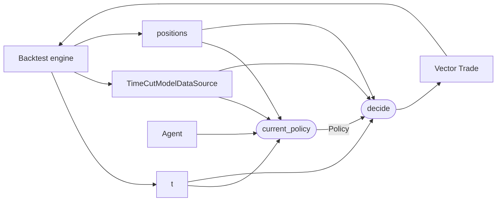

# `agents` module

Agent abstraction: the higher-level object that owns how a
[`Policy`](policies.md) evolves across backtest (or live) time. The
backtest engine queries the Agent at every tick for the Policy that
should make the decision at that moment; between ticks the Agent is
free to refit parameters, swap policies, advance a schedule, or
otherwise update what it returns next.

This is the Sutton-&-Barto split: **Policy** = the `decide` function;
**Agent** = the thing that carries the Policy and the machinery that
changes it over time. A policy that depends on a periodically-refit
ridge model is still a frozen Policy; the *fitting cadence and the
fit itself* live on the Agent.

## Data flow



Per tick: the engine asks the Agent for the current Policy, then
calls `decide` on it. The same `(t, cut, positions)` triple is
visible to both calls.

## The abstraction

```julia
abstract type Agent end

current_policy(a::Agent, t::DateTime, data::TimeCutModelDataSource,
               positions::AbstractVector{Position}) -> Policy
```

One method, four arguments, one Policy returned. Concrete agents
subtype `Agent` and implement `current_policy`. The returned Policy
must be valid for at least the current tick.

### `StaticAgent`

```julia
struct StaticAgent{P<:Policy} <: Agent
    policy::P
end
current_policy(a::StaticAgent, _, _, _) = a.policy
```

The trivial agent: holds one Policy and returns it forever. Bridges
the fixed-policy case into the Agent-driven engine so every backtest
shares one driver path, and lets `run_backtest(policy, ...)` be a
one-line wrapper around the Agent overload.

## Key decisions

| Decision | Why |
|---|---|
| **Per-tick query, not per-event callback** | The engine calls `current_policy` on every tick rather than asking the Agent to push policy-change events. This keeps the engine loop one-shape (mirrors the per-tick `decide` call) and means a "refit on schedule" Agent is a trivial calendar check inside `current_policy`. Cost on minute-data over a year for a no-op `current_policy`: dwarfed by data IO. |
| **`current_policy` sees `(t, cut, positions)`** | Same arguments as `decide`. A refit-on-month-boundary Agent needs `t`; an Agent that retrains on a lookback window needs `cut`; an Agent that adapts position sizing to current exposure needs `positions`. Passing all three uniformly means no Agent ever has to thread state out-of-band. |
| **Agent is not itself a Policy** | The two have different responsibilities (evolve over time vs. decide for one tick) and different invariants (mutable cadence/state vs. frozen for the tick). Conflating them collapses the split that motivates the abstraction in the first place. An Agent that *never* changes its Policy is a `StaticAgent`, not a Policy worn as an Agent. |
| **Engine accepts both `Agent` and `Policy`** | `run_backtest(policy, ...)` is a one-line wrapper around `run_backtest(StaticAgent(policy), ...)`. The bare-policy form is the natural primitive for training/evaluation code that wants to score a single candidate Policy over a window without constructing an Agent. |
| **No refit-schedule protocol** | The engine does not have a separate `refit_times(agent, source)` hook. Anything an Agent wants to schedule it gates inside `current_policy`, the same way policies gate inside `decide`. One uniform query model, no engine-side knowledge of how an Agent is structured internally. |

## Responsibility boundaries

**Owns:** the `Agent` abstract type, the `current_policy` contract,
the `StaticAgent` base case.

**Does NOT own:**

- The decide function. That is the [`policies`](policies.md) module.
- The tick loop. That is the [backtest engine](backtest.md); the
  engine drives both `current_policy` and `decide`.
- Training algorithms. Concrete trainer Agents (ridge-refit,
  walk-forward, online-update) will live alongside their fitting
  code in dedicated submodules, layered on top of this abstraction.
- Reporting / PnL aggregation. Downstream of the engine, just like
  for policies.

## Adding a concrete agent

A walk-forward Agent that retrains a fitted Policy at the start of
each month looks like:

```julia
mutable struct MonthlyRefitAgent{F,P<:Policy} <: Agent
    fit::F                       # (t, cut, positions) -> Policy
    current::P
    last_refit_month::Tuple{Int,Int}   # (year, month)
end

function current_policy(a::MonthlyRefitAgent, t::DateTime,
                        cut::TimeCutModelDataSource,
                        positions::AbstractVector{Position})
    ym = (year(t), month(t))
    if ym != a.last_refit_month
        a.current = a.fit(t, cut, positions)
        a.last_refit_month = ym
    end
    return a.current
end
```

The Agent stays small: a cadence check plus a callback that produces
the next frozen Policy. The Policy itself remains a plain `<: Policy`
struct with the same `decide` contract as any other.

## Future work

- **Online-updating agents.** Today every Agent in scope hands out
  policies that are frozen between refits. An Agent that updates a
  parameter on every tick (online ridge, EWMA bandwidth) fits the
  abstraction unchanged but is not exercised yet.
- **Multi-policy agents.** An Agent that runs multiple candidate
  policies in shadow and promotes the best is expressible today
  (return the winner from `current_policy`), but useful enough to
  factor out as a reusable `ChampionChallengerAgent`.
- **Agent-side state-of-the-world snapshots.** A reporting hook to
  log `current_policy` decisions and the data they were made on, so
  walk-forward backtests are auditable end-to-end without
  reconstructing the agent's internal state.
- **Live-trading bridge.** The same `current_policy` signature can
  drive a live loop: the live engine asks the Agent for the current
  Policy on each market event, the Agent owns refit cadence and
  parameter updates, and the Policy's `decide` produces orders.

## Layout

```
src/agents/
    agent.jl      # abstract Agent + current_policy + StaticAgent

test/agents/
    test_agent.jl
```

All files are `include`d into the top-level `VolSurfaceAnalysis`
module; no submodule wrappers.
