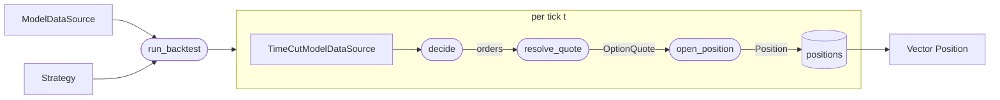

# `backtest` module

The driver that turns a [`Strategy`](strategies.md) plus a
[`ModelDataSource`](model_data.md) into a ledger of filled
[`Position`s](positions.md). Two concerns:

- A composition wrapper that enforces no-lookahead at the type level.
- A single tick loop that asks the strategy what to do at each
  timestamp and fills its returned trades.

Reporting / PnL aggregation is intentionally not here -- the engine
returns the bare ledger and downstream code (later) computes
metrics off it.

## Data flow



## `TimeCutModelDataSource`

```julia
struct TimeCutModelDataSource
    inner::ModelDataSource
    cutoff::DateTime
end
```

Composition wrapper around a `ModelDataSource`. Every accessor
forwards to `inner` after a `ts <= cutoff` check; queries past the
cutoff return the natural absent-value (`nothing` for chains and
surfaces, `missing` for spots). Rate and div curves pass through
unfiltered -- they are math objects, not historical observations,
and evaluating them at any `ts` (past or future) is a legitimate
forward query rather than lookahead.

Not a Julia subtype of `ModelDataSource` (concrete structs are
final). Strategies declare the cut wrapper as their data parameter
explicitly: that gives the supported accessor interface a no-lookahead
boundary rather than relying on each call site to remember the rule.

Surface and chain caches live on the inner `ModelDataSource`; cuts
do not invalidate them (surfaces at `ts <= cutoff` are immutable
historical facts).

## The engine

```julia
run_backtest(strategy::Strategy, source::ModelDataSource,
             from::DateTime, to::DateTime) -> Vector{Position}
```

The loop:

```julia
positions = Position[]
for t in available_timestamps(source, from, to)
    cut    = TimeCutModelDataSource(source, t)
    orders = decide(strategy, t, cut, positions)
    for trd in orders
        qte      = resolve_quote(cut, trd, t)
        spot_val = get_spot(cut, t)
        push!(positions, open_position(trd, qte, Float64(spot_val)))
    end
end
return positions
```

That is the whole engine. Strategies that need a sub-range filter
the schedule themselves inside `decide`.

### `resolve_quote`

```julia
resolve_quote(cut::TimeCutModelDataSource, trade::Trade, t::DateTime)
    -> OptionQuote
```

Looks up the `OptionQuote` in `get_chain(cut, t)` whose contract
matches `trade` exactly on `(underlying, strike, expiry, option_type)`.
Errors on absent chain or strike-not-found -- both indicate the
strategy emitted a trade for a contract it should not have known
about.

Goes through `get_chain` rather than `get_surface` because surfaces
retain only inverted IVs; the raw bid/ask the fill needs lives on
the chain quote, not the slice.

## Key decisions

| Decision | Why |
|---|---|
| **Composition over inheritance for the cut wrapper** | Julia concrete structs are final, so `TimeCutModelDataSource <: ModelDataSource` is not an option. Composition (`inner::ModelDataSource` + `cutoff::DateTime`) plus parallel accessor methods is the idiomatic alternative. Strategies that need the cut state it in the signature; helpers that take a raw `ModelDataSource` are not callable with a cut, which is correct -- those helpers do not respect the cutoff. |
| **No-lookahead at the type level** | `decide` takes `TimeCutModelDataSource`, not `ModelDataSource`. Through exported accessors, a strategy cannot accidentally reach future observations. Master enforced this with a runtime wrapper passed in via an argument; the rebuild lifts it into the function signature. |
| **`resolve_quote` reads chains, not surfaces** | The rebuild's `RawSurface` stores only inverted IVs; raw bid/ask lives on the `OptionQuote`s in the chain. Going through the chain for fills keeps the spread-respecting semantics of master without forcing a price-from-IV path on every tick. (A future BS-priced-quote fill mode would dispatch off a separate trait on the data source.) |
| **Bare ledger return, no `BacktestResult`** | Reporting needs are not nailed down yet, and master's `BacktestResult.pnl` parallel vector breaks once close-as-counter-trade lands (a close `Position` does not have its own contribution -- it nets another fill). Returning `Vector{Position}` lets the reporting layer pick its own shape (per-tick cash flows, per-contract netting, ...) without committing now. |
| **Walk every available timestamp** | Master let strategies provide an `entry_schedule(strategy)` that drove the engine loop. The rebuild walks every available `ts` and lets the strategy gate inside `decide`. Cost on minute-data: ~7ms per backtest-year from no-op `decide` calls -- negligible. Benefit: one engine loop shape, no special case for event-driven or monitoring strategies, and the no-lookahead boundary always covers the current `t`. |
| **No `clear_cache!` between ticks** | Surface and chain caches stay warm across the whole loop. Long backtests that need to bound memory can call `clear_cache!(source)` themselves; the engine does not invent a policy. |

## Responsibility boundaries

**Owns:** `TimeCutModelDataSource`, the tick loop, the
`Trade -> OptionQuote -> Position` filling chain.

**Does NOT own:**

- Strategy logic. That is the [`strategies`](strategies.md) module.
- Data acquisition. That is the [`data`](data.md) and
  [`model_data`](model_data.md) modules.
- Reporting / PnL aggregation. Today the caller computes whatever
  it needs from the returned `Vector{Position}`.
- Concurrency. Single-threaded.

## Failure modes

| Condition | Behavior |
|---|---|
| `decide` returns `Trade[]` | normal; engine continues |
| `decide` emits trade for a contract not in the chain at `t` | `resolve_quote` errors |
| Spot missing at a tick where `decide` emits an order | `run_backtest` errors |
| Strategy reads `get_surface(cut, t')` for `t' > t` | accessor returns `nothing` |
| Strategy never emits any trade | engine returns empty `Vector{Position}` |

## Future work

- **Result wrapper for reporting.** A `BacktestResult` carrying the
  ledger plus precomputed views (open-positions snapshots, per-tick
  cash flows) once the reporting module exists.
- **Sparse strategy tick override.** Optional
  `tick_times(strategy, source) -> iterable` for strategies that
  precompute their schedule and want to skip the per-tick `decide`
  call entirely.
- **BS-priced fills.** When a chain lacks bid/ask but a surface
  exists, an alternative `resolve_quote` mode would synthesize a
  quote from `price(surface, ...)` plus a configurable spread.
  Dispatch off a `QuoteConvention` trait on the data source.
- **Multi-asset backtest.** Today `get_spot(cut, t)` returns the
  single underlying's spot. Multi-symbol strategies would need
  per-`Underlying` spot lookups during fills.

## Layout

```
src/backtest/
    time_cut.jl     # TimeCutModelDataSource
    engine.jl       # resolve_quote + run_backtest

test/backtest/
    test_time_cut.jl
    test_engine.jl
```

All files are `include`d into the top-level `VolSurfaceAnalysis`
module; no submodule wrappers.
