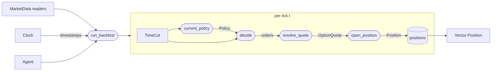

# `backtest` module

The driver that turns an [`Agent`](agents.md) (which hands out a
[`Policy`](policies.md) per tick) plus a [`MarketData`](market_data.md)
map and a `Clock` into a ledger of filled [`Position`s](positions.md).
Two concerns:

- The no-lookahead boundary, which is the `market_data` `TimeCut`
  passed to agents and policies in the function signature.
- A single tick loop that asks the agent for the current policy, asks
  that policy what to do, and fills its returned trades.

Reporting / PnL aggregation is intentionally not here -- the engine
returns the bare ledger and downstream code computes metrics off it.

## Data flow


```mermaid
flowchart LR
    Data[MarketData readers]
    Clock[Clock]
    Agent[Agent]
    Engine([run_backtest])
    Data --> Engine
    Clock -->|timestamps| Engine
    Agent --> Engine

    subgraph Loop["per tick t"]
        direction LR
        Cut[TimeCut]
        CP([current_policy])
        D([decide])
        RQ([resolve_quote])
        OP([open_position])
        Cut --> CP
        CP -->|Policy| D
        Cut --> D
        D -->|orders| RQ
        RQ -->|OptionQuote| OP
        OP -->|Position| Ledger[(positions)]
    end

    Engine --> Loop
    Ledger --> Out[Vector Position]
```

## The no-lookahead boundary

`decide` and `current_policy` take a `TimeCut`, not the bare map. A
cut masks every shape at its cutoff and passes itself down as the
context, so reads a derived provider makes on the policy's behalf (the
surface's quotes, spot and curves) are masked too: no-lookahead through
derived data is structural, not a convention. Because `timestamp` is
visibility time on every kind, the cut is the complete rule; there is
no rate/div passthrough any more, a curve snapshot is visible or it is
not. Caches live on the readers below the cut and are cut-independent
(see [`market_data`](market_data.md)).

## The engine

```julia
run_backtest(agent::Agent,  data::MarketData, from, to, clock::Clock) -> Vector{Position}
run_backtest(policy::Policy, data::MarketData, from, to, clock::Clock) -> Vector{Position}
```

`data` is the opened reader map (`run_experiment` opens and closes it
around the call). The loop:

```julia
positions = Position[]
ticks = something(tick_times(agent, data, from, to), timestamps(data, clock, from, to))
for t in ticks
    cut    = TimeCut(data, t)
    policy = current_policy(agent, t, cut, positions)
    orders = decide(policy, t, cut, positions)
    for trd in orders
        qte  = resolve_quote(cut, trd, t)
        spot = only_or_missing(at(cut, SpotPrice, trd.underlying, t))   # error if missing
        push!(positions, open_position(trd, qte, spot.price))
    end
end
return positions
```

That is the whole engine. The bare-`Policy` overload delegates to
`run_backtest(StaticAgent(policy), ...)`, so a single driver path
handles fixed-policy and agent-driven (refitting / learning) backtests
alike.

**Ticks come from the declared clock** -- the timestamps of one kind
for one selector, part of the experiment's core identity -- unless the
agent's `tick_times` override returns a schedule. The override is a
list of *candidates*: a candidate with no data yields `Trade[]` in
`decide`, and the experiment's window end is still the last clock
tick, never a candidate.

### `resolve_quote`

```julia
resolve_quote(cut::TimeCut, trade::Trade, t::DateTime) -> OptionQuote
```

Looks up the quote in `at(cut, OptionQuote, trade.underlying, t)`
whose contract matches `trade` exactly on `(underlying, strike, expiry,
option_type)`. Errors on an empty chain or strike-not-found -- both
indicate the policy emitted a trade for a contract it should not have
known about. Reads quotes rather than surfaces because surfaces retain
only inverted IVs; the raw bid/ask the fill needs lives on the quote.

The fill spot is the trade's own underlying's spot. A `spot_for` remap
on the surface provider prices the surface, not the fill or the
settlement, and `run_experiment` resolves settlement the same way -- per
trade, for that leg's own selector.

## Key decisions

| Decision | Why |
|---|---|
| **Engine driven by `Agent`, not `Policy`** | The agent layer is where policy-evolution lives (refits, swaps, learning). Making the engine ask `current_policy` per tick means a fixed-policy backtest, a monthly-refit backtest, and an online-learning backtest all use the same loop. The bare-`Policy` overload exists only for ergonomics. |
| **No-lookahead at the type level, through derived data** | `current_policy` and `decide` take `TimeCut`. The cut is the only map a policy and every derived provider under it can see, so neither a refit's lookback nor a surface build can reach a future observation. The legacy codebase enforced this with a runtime wrapper; the rebuild lifts it into the signature and, with the map-as-context design, into the data layer itself. |
| **A declared clock** | The tick grid is part of the experiment, not an implicit property of one storage. Two experiments on the same data with different clocks are different experiments, and the window end is well defined (the last tick). |
| **`resolve_quote` reads quotes, not surfaces** | `RawSurface` stores only inverted IVs; raw bid/ask lives on `OptionQuote`. Going through the chain keeps the spread-respecting semantics of the legacy codebase. |
| **Bare ledger return, no `BacktestResult`** | Returning `Vector{Position}` lets the reporting layer pick its own shape (per-tick cash flows, per-contract netting, ...) without committing now; `PnLSeries` is that layer today. |
| **Per-tick `tick_times` override, candidates only** | Sparse policies (once a day on minute data) skip the engine churn; the engine trusts the schedule verbatim (sorted, unique, in range) and tolerates candidates with no data. |

## Responsibility boundaries

**Owns:** the tick loop, the `Trade -> OptionQuote -> Position`
filling chain, the bare-`Policy` convenience overload.

**Does NOT own:**

- The time cut itself. `TimeCut` is a `market_data` type; the engine
  only builds one per tick.
- Policy logic ([`policies`](policies.md)) and policy evolution
  ([`agents`](agents.md)).
- Data acquisition ([`market_data`](market_data.md)).
- Opening and closing the data: `run_experiment` does that around
  the engine.
- Reporting / PnL aggregation. Concurrency (single-threaded).

## Failure modes

| Condition | Behavior |
|---|---|
| `decide` returns `Trade[]` | normal; engine continues |
| `decide` emits a trade for a contract not in the chain at `t` | `resolve_quote` errors |
| Spot missing at a tick where `decide` emits an order | `run_backtest` errors |
| Policy reads any shape at `t' > t` through the cut | empty result |
| Clock selector has no data in the window | no ticks; empty ledger |
| Agent or policy never emits any trade | engine returns empty `Vector{Position}` |

## Future work

- **Result wrapper for reporting**, once views beyond `PnLSeries` are
  needed.
- **BS-priced fills.** When a chain lacks bid/ask but a surface
  exists, an alternative `resolve_quote` mode would synthesize a
  quote from `price(surface, ...)` plus a configurable spread.
- **Multi-asset fills** already resolve per trade underlying; a
  multi-asset *clock* (union of grids) is the missing piece.

## Layout

```
src/backtest/
    engine.jl       # resolve_quote + run_backtest (Agent and Policy)

test/backtest/
    test_engine.jl
```

All files are `include`d into the top-level `VolSurfaceAnalysis`
module; no submodule wrappers.
