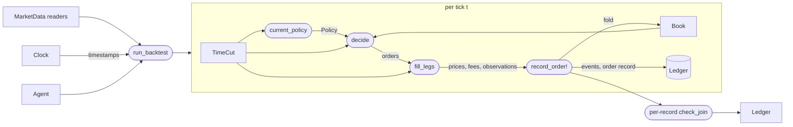

# `backtest` module

The driver that turns an [`Agent`](agents.md) (which hands out a
[`Policy`](policies.md) per tick) plus a [`MarketData`](market_data.md)
map and a `Clock` into a [`Ledger`](ledger.md), and the simulated venue
that prices what the policy decides. One principle: **the engine
computes, the ledger records.** The engine turns a decision into
immutable inputs (per-leg prices, fees and observations) and makes one
call; every id, the group, the order record and the events are minted
inside that call. The record is constructed before the event commit;
afterward it is pushed beside the events and the counters advance. The
engine holds no state beyond the ledger, which owns the book it folds.

## Data flow


```mermaid
flowchart LR
    Data[MarketData readers]
    Clock[Clock]
    Agent[Agent]
    Engine([run_backtest])
    Data --> Engine
    Clock -->|timestamps| Engine
    Agent --> Engine

    subgraph Loop["per tick t"]
        direction LR
        Cut[TimeCut]
        CP([current_policy])
        D([decide])
        FL([fill_legs])
        RO([record_order!])
        Cut --> CP
        CP -->|Policy| D
        Cut --> D
        Book[Book] --> D
        D -->|orders| FL
        Cut --> FL
        FL -->|prices, fees, observations| RO
        RO -->|events, order record| Ledger[(Ledger)]
        RO -->|fold| Book
    end

    Engine --> Loop
    RO --> CJ([per-record check_join]) --> Out[Ledger]
```

## The tick order

1. **Lifecycle** (slice 3): expiries due at or before `t` are booked so
   the policy sees expired legs gone. The slot is named in the loop and
   empty until then.
2. **Decide.** The cut at `t`, the current policy, and `L.book`: the
   ledger's owned fold, kept equal to `book_as_known(L, known_to)` by
   supported ledger calls for every order record the tick produces. A
   policy reads it and must not mutate it; direct mutation would be outside
   the supported ledger boundary.
3. **Fill.** For each order, `fill_legs` prices every leg before
   anything is written: the quote through `resolve_quote`, the price
   through the fill rule, the spot of the leg's own underlying, then the
   commission of the whole order. A leg that cannot honestly be priced
   is a named failure here, so no partial structure reaches the ledger.
   Then `record_order!` books the structure as one transaction; every
   order of a tick records the ledger sequence before the tick's first
   order as what it could see (`known_to`), so the second order of a tick
   does not appear to have seen the first order's fills.

The per-record `check_join` runs immediately after each append. The
whole-ledger form remains the persistence write/load audit.

## The venue

Shaped like Interactive Brokers, as three values: a price rule, a cost
model and the class's tick, keywords on `run_backtest` (defaults in
`run_experiment`) until slice 4 puts them in config and identity. The
rule and the model are symbols dispatched through two small tables in
the `_METRIC_TABLE` style; `Fill.fill_rule` is literally the table key.

- **Structure.** A combo order fills in whole units or not at all, as
  a guaranteed combo does at IBKR; a lone leg never happens. This is
  not a value: it is `record_order!` plus the engine pricing every leg
  first.
- **Price** (`fill_price(rule, bid, ask, side, tick_cents)`, raw values
  in so `check_join` can recompute it from an observation).
  `:cross_spread`: a buy takes the ask, a sale the bid, rounded onto the
  tick away from the trader (rule R5 below); a missing required side is
  `missing`. `:broker_execution` is not a rule of ours and is not in the
  table: it names a price the broker reported. This slice still records
  one observation per leg under it, permits missing quote sides, and does
  not consult that observation; an absent observation waits for the live adapter.
- **Cost** (`commission(model, prices, quantities)`, non-negative cents
  per leg, negated into `Fee` amounts). `:none`, and
  `:ibkr_pro_us_options`: IBKR Pro's fixed-rate US options schedule at
  the lowest monthly-volume tier with its per-order minimum, the order's
  total shared over the legs in whole cents by cumulative rounding so the
  shares sum exactly. Higher tiers and third-party fees are not modelled.
  A commission of zero books no `Fee`.

An unknown rule or model errors naming the known ones.

## Public surface

```julia
run_backtest(agent::Agent,  data, from, to, clock; fill_rule = :cross_spread,
             cost_model = :ibkr_pro_us_options, tick_cents = 1) -> Ledger
run_backtest(policy::Policy, data, from, to, clock; kw...)      -> Ledger   # StaticAgent wrapper

resolve_quote(cut::TimeCut, contract::ContractKey, t) -> OptionQuote
fill_legs(cut, order::Order, t; fill_rule, cost_model, tick_cents)
    -> (prices, fees, observations, fill_rule)                  # record_order!'s per-leg keywords
check_join(L::Ledger; tick_cents = 1) -> Nothing
check_join(L::Ledger, rec::OrderRecord; tick_cents = 1) -> Nothing

fill_price(rule::Symbol, bid, ask, side::Side, tick_cents::Int) -> Union{Float64,Missing}
commission(model::Symbol, prices, quantities) -> Vector{Int}
```

Ticks come from the declared clock (the timestamps of one kind for one
selector, part of core identity) unless the agent's `tick_times`
override returns a schedule; a candidate with no data yields `Order[]`
in `decide`. Open lots at the window end stay open; nothing is settled
here.

## `check_join`: the cross-record contract

The fill review's list, checked between the events and the order
journal after each engine append and across the whole ledger before
persistence write and after load. Order records: ids are
`1, 2, ...` in order, each `first_leg_id` is the previous record's plus
its leg count (leg ids are contiguous and never shared), one observation
per leg. For every `Fill`: its order leg exists; contract, side and
intent equal the leg's and group equals the record's; the fills of one
leg sum to at most its quantity; and, unless the rule is
`:broker_execution`, the observation was taken at or before the
decision, the side the rule needs is present, and the price is the rule
applied to the observation on the tick. Under `:broker_execution`, this
slice keeps one observation per leg but does not consult it. The
per-record form scans only fills appended after the decision boundary
whose leg ids belong to that record; cumulative partial-fill quantity
remains a whole-ledger check. Execution-id uniqueness is the ledger's
own `DuplicateExecution`, not repeated here.

## Failure modes

| Condition | Behavior |
|---|---|
| `decide` returns `Order[]` | normal; engine continues |
| A leg names a contract not in the chain at `t` (or the chain is empty) | `UnpriceableLeg(contract, t, :no_quote)`, nothing written |
| The side the rule needs is `missing` on the quote | `UnpriceableLeg(..., :no_executable_side)` |
| The leg's underlying is served but has no spot at `t` | `UnpriceableLeg(..., :no_spot)` |
| Nothing serves the leg's underlying (quotes or spots) | `UnservedSelector`, from the data layer |
| A `Close` leg with nothing to close, or for more than is open | `NothingToClose` / `ExceedsOpen` from `record_order!`; the structure does not land |
| A leg price that is not whole cents, an unlisted underlying, a fill after expiry | the ledger's named failure; nothing lands |
| A fill and its order leg disagree | `JoinViolation(field, id, reason)` from `check_join` |
| An unknown fill rule or cost model | error naming the known ones |
| Policy reads any shape at `t' > t` through the cut | empty result |
| Clock selector has no data in the window | no ticks; empty ledger |
| Agent or policy never emits an order | empty ledger, no orders |

Every named failure prints its name. A failure in the tick loop leaves
the ledger, its counters, its order journal and its owned book as they were
before the order.

## Key decisions

| Decision | Why |
|---|---|
| **The engine computes, the ledger records** | `fill_legs` is a pure function of the cut and the order; `record_order!` mints every id and the group inside one transaction and constructs the record before committing events. The engine keeps no parallel journal; a live loop replaces `fill_legs` with the broker's reports without touching the writer. |
| **Every leg priced before anything is written** | Proposal decision 10: a structure fills whole or not at all, as a guaranteed combo does at IBKR. A leg that cannot be priced is an error before the batch, so no partial structure ever reaches the ledger. |
| **Venue as two symbol tables and a tick, no type hierarchy** | Three plain values are what config and identity will carry in slice 4; `Fill.fill_rule` already stores the key. A hierarchy would name the same three things twice. |
| **R5: fill prices on the tick, rounded away from the trader** | The ledger refuses cash that is not whole cents; synthesized and modelled quotes are not on the tick; exchanges only trade on it. Rounding against the trader keeps the rule as conservative as crossing the spread already is. The observation keeps the raw quote; the fill carries the tick price. |
| **Observations recorded per leg, fills carry none** | Research records what pricing saw. This slice retains an observation row with optional quote sides for broker executions but ignores it during validation; truly observation-less live records arrive with the adapter. The join is validated, never assumed. |
| **`known_to` captured once per tick** | Sequence, not recorded time, bounds what a decision saw; the second order of a tick did not see the first's fills. |
| **Engine driven by `Agent`, not `Policy`** | Refits, swaps and learning live in the agent layer; one loop serves a fixed policy and a learning agent alike. The bare-`Policy` overload is ergonomics. |
| **No-lookahead at the type level, through derived data** | `current_policy` and `decide` take `TimeCut`; every read a derived provider makes on the policy's behalf goes through the cut. |
| **A declared clock** | The tick grid is part of the experiment; two experiments on the same data with different clocks are different experiments. |
| **`resolve_quote` reads quotes, not surfaces** | A surface retains only inverted IVs; the raw bid/ask the fill needs lives on the chain quote. |

## Responsibility boundaries

**Owns:** the tick loop and its order; the venue (`fill_price`,
`commission`, their tables, the tick); `fill_legs`, `resolve_quote`;
`check_join`; the bare-`Policy` overload.

**Does NOT own:** the time cut (a `market_data` type); policy logic
and policy evolution; data acquisition; opening and closing the data
(`run_experiment`); the writer, the events, the book and the cash rules
([`ledger`](ledger.md)); lifecycle and settlement (slice 3); marks and
the equity curve (slice 5); metrics and persistence.

## Conventions consulted

| Convention | Source | Consequence |
|---|---|---|
| A multi-leg option order fills in whole units or not at all | Interactive Brokers, [Understanding Guaranteed vs. Non-guaranteed Combination Orders](https://www.ibkrguides.com/kb/guaranteed-non-guaranteed-combo-orders.htm): "a guaranteed multi-leg order is one in which executions are guaranteed to be delivered simultaneously for each leg and in proportion to the leg ratio" | `record_order!` plus every leg priced first; a lone leg never happens |
| Commission per contract by premium tier, with a per-order minimum | Interactive Brokers, [US options commissions](https://www.interactivebrokers.com/en/pricing/commissions-options.php), IBKR Pro fixed, monthly volume ≤ 10,000, fetched 2026-09-12: USD 0.25 below a 0.05 premium, 0.50 from 0.05 to below 0.10, 0.65 at 0.10 and above, minimum USD 1.00 per order; the page's worked examples are the test literals | `:ibkr_pro_us_options`; one `Fee` per fill |
| Options on SPY, QQQ and IWM quote and trade in one-cent increments at every premium | MIAX, [Options Penny Program, all options exchanges](https://www.miaxglobal.com/markets/us-options/all-options-exchanges/penny-program), describing the industry-wide Penny Interval Program: penny classes trade in $0.01 below $3.00 and $0.05 at or above, but options overlying QQQ, SPY and IWM "are quoted and traded in minimum increments of $0.01 for all series regardless of the price" | `tick_cents = 1`; a non-penny tick per class is a later model |
| An execution report carries a broker-assigned execution id, unique per report | FIX [ExecutionReport (35=8)](https://www.onixs.biz/fix-dictionary/4.4/msgtype_8_8.html), `ExecID` (tag 17) | one execution id per fill, minted by the writer here, reported by the broker live; a duplicate is refused |
| Backend selection by symbol through a dispatch table with defaults | Optim.jl, MLJ.jl; this repo's `_METRIC_TABLE` | `_FILL_RULES`, `_COST_MODELS` |

## Layout

```
src/backtest/
    execution.jl    # the venue: fill_price, commission, their tables
    engine.jl       # resolve_quote, fill_legs, check_join, run_backtest

test/backtest/
    test_execution.jl
    test_engine.jl
```

All files are `include`d into the top-level `VolSurfaceAnalysis`
module; no submodule wrappers.
