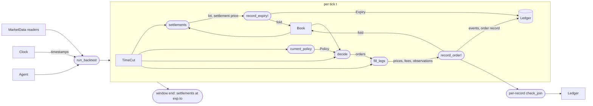

# `backtest` module

The driver that turns an [`Agent`](agents.md) (which hands out a
[`Policy`](policies.md) per tick) plus a [`MarketData`](market_data.md)
map and a `Clock` into a [`Ledger`](ledger.md), and the simulated venue
that prices what the policy decides. One principle: **the engine
computes, the ledger records.** The engine turns a decision into
immutable inputs (per-leg prices, fees and observations) and makes one
call; every id, the group, the order record and the events are minted
inside that call. The record is constructed before the event commit;
afterward it is pushed beside the events and the counters advance. The
lifecycle step has the same shape: a function of the cut says which lots
fell due and at what price, and the loop calls the ledger's own
`record_expiry!`. The engine defines nothing that mutates, and holds no
state beyond the ledger, which owns the book it folds.

## Data flow


```mermaid
flowchart LR
    Data[MarketData readers]
    Clock[Clock]
    Agent[Agent]
    Engine([run_backtest])
    Data --> Engine
    Clock -->|timestamps| Engine
    Agent --> Engine

    subgraph Loop["per tick t"]
        direction LR
        Cut[TimeCut]
        SE([settlements])
        RE([record_expiry!])
        CP([current_policy])
        D([decide])
        FL([fill_legs])
        RO([record_order!])
        Cut --> SE
        Book[Book] --> SE
        SE -->|lot, settlement price| RE
        RE -->|Expiry| Ledger[(Ledger)]
        RE -->|fold| Book
        Cut --> CP
        CP -->|Policy| D
        Cut --> D
        Book --> D
        D -->|orders| FL
        Cut --> FL
        FL -->|prices, fees, observations| RO
        RO -->|events, order record| Ledger
        RO -->|fold| Book
    end

    Engine --> Loop
    Loop --> WE([window end: settlements at exp.to])
    RO --> CJ([per-record check_join]) --> Out[Ledger]
```

## The tick order

1. **Lifecycle.** The lots falling due in `(prev, t]` are settled
   before anything else, so a lot that settled is already gone from the
   book the policy is handed. A lot whose settlement price could not be
   resolved stays open, stays visible to every later decision, and has
   been warned about once; `lot.contract.expiry <= t` is what tells a
   policy it is holding one -- inclusive at `t`, because the interval
   that examines a lot is too, so the tick *at* an expiry already hands
   the policy the lot that failed to settle there. `settlements`
   computes what settles and at
   what price; the ledger's own `record_expiry!` books each one,
   separately -- two lots expiring at one instant are independent facts,
   and batching them would claim an atomicity that does not exist.
2. **Decide.** The cut at `t`, the current policy, and `L.book`: the
   ledger's owned fold, kept equal to `book_as_known(L, known_to)` by
   supported ledger calls for every order record the tick produces. A
   policy reads it and must not mutate it; direct mutation would be outside
   the supported ledger boundary.
3. **Fill.** For each order, `fill_legs` prices every leg before
   anything is written: the contract still trades at `t` (its expiry is
   strictly later), the quote through `resolve_quote`, the price through
   the fill rule, the spot of the leg's own underlying, then the
   commission of the whole order. A leg that cannot honestly be priced
   is a named failure here, so no partial structure reaches the ledger.
   Then `record_order!` books the structure as one transaction; every
   order of a tick records the ledger sequence before the tick's first
   order as what it could see (`known_to`), so the second order of a tick
   does not appear to have seen the first order's fills.
4. **Window end.** The lifecycle once more, at the evaluation endpoint
   `to`, which may be later than the last policy tick. Lots still open
   after it stay open; nothing is force-settled.

`known_to` is captured *after* the tick's expiries, so the sequence an
order records as what its decision saw already includes them. The
per-record `check_join` runs immediately after each append. The
whole-ledger form remains the persistence write/load audit.

## The venue

Shaped like Interactive Brokers, as three values: a price rule, a cost
model and the class's tick, keywords on `run_backtest` (defaults in
`run_experiment`) until slice 4 puts them in config and identity, along
with the settlement rule. The
rule and the model are symbols dispatched through two small tables in
the `_METRIC_TABLE` style; `Fill.fill_rule` is literally the table key.

- **Structure.** A combo order fills in whole units or not at all, as
  a guaranteed combo does at IBKR; a lone leg never happens. This is
  not a value: it is `record_order!` plus the engine pricing every leg
  first.
- **Price** (`fill_price(rule, bid, ask, side, tick_cents)`, raw values
  in so `check_join` can recompute it from an observation).
  `:cross_spread`: a buy takes the ask, a sale the bid, rounded onto the
  tick away from the trader (rule R5 below); a missing required side is
  `missing`. `:broker_execution` is not a rule of ours and is not in the
  table: it names a price the broker reported. This slice still records
  one observation per leg under it, permits missing quote sides, and does
  not consult that observation; an absent observation waits for the live adapter.
- **Cost** (`commission(model, prices, quantities)`, non-negative cents
  per leg, negated into `Fee` amounts). `:none`, and
  `:ibkr_pro_us_options`: IBKR Pro's fixed-rate US options schedule at
  the lowest monthly-volume tier with its per-order minimum, the order's
  total shared over the legs in whole cents by cumulative rounding so the
  shares sum exactly. Higher tiers and third-party fees are not modelled.
  A commission of zero books no `Fee`.

An unknown rule or model errors naming the known ones.

## Lifecycle and settlement

A `ContractKey`'s `expiry` is an instant, and the ticker parser stamps
the listed date at 16:00 ET; nothing constrains it to that. What settles
a contract is the *session-close print*: the underlying's last
regular-hours print of the settlement session, which the rule reads as
the last print of its reference window and which is the same thing only
under the regular-session `SpotPrice` contract
([`market_data`](market_data.md)). That is a stated departure from the
facts -- the official closing auction is not in the data -- and it is
the only one here; the payoff itself is real, intrinsic under exercise
by exception.

**Sessions come from the spot tree; the calendar only contradicts it.** A
date is a session when the underlying printed in the reference window on
it, and its close is the last of those prints. Nothing else is
consulted, so an early close needs no early-close table -- but what
makes the answer right there is an *input contract*, not the bounds:
`SpotPrice` providers serve regular-session prints only
([`market_data`](market_data.md)), and under that contract the last
print in the window of a 13:00 ET close is the 13:00 one. Break the
contract and the rule breaks silently: a 15:59 extended-hours print on
an early-close day is inside the 09:30-16:00 window and becomes the
settlement price, and nothing here can tell it apart from a regular one
-- a `SpotPrice` does not record which session it came from, and no
narrower window helps, since 15:59 is regular-hours-shaped. The six
early-close sessions of a ten-year SPY run settle at their 13:00 prints
because the tree they read holds nothing after 13:00 on those dates,
which is the contract holding, not the rule guaranteeing it. The
exchange calendar answers one question only, and it is a *check*: a
printless date the calendar calls open is a data gap, named and
reported, never evidence that the exchange was closed (design rule 7). Ad-hoc closures the calendar may lag behind have
a cited `const` seam beside it, empty today.

**The reference window never runs past the expiry instant.** It opens at
09:30 ET and closes at the earlier of 16:00 ET and the contract's own
expiry. For the 16:00 ET convention the parser stamps, and for every
walked-back session, that is the session close and nothing changes; for
an intraday expiry it is the expiry. Without the bound such a contract
settles at a print from after it stopped existing -- permitted by the
tick's cut, which is at or after the expiry, but incoherent in the
effective-time replay: an `Expiry` stamped at noon would carry a price
that did not exist until 16:00, so `book_effective` at 12:30 would show
a lot settled at a future number.

**The window is consumed as a stream.** `between` promises an iterable,
not a container, and settlement is its only consumer outside
`market_data`. Each window is therefore traversed exactly once, keeping
the last record it yields -- never indexed, and never probed for
emptiness and then read again. A provider that streams its range one
partition at a time, as the parquet bar reader already does, serves the
rule as well as an in-memory vector does.

**The rule has a domain, and says so.** `settlement_price` requires the
cut to reach the contract's expiry; a cut short of it is
`UnpriceableLeg(..., :no_session_close)`. A cut that cannot see the
settlement session's close cannot answer *what did this settle at* -- it
would return a provisional intraday print, or read a truncated window
and walk back past a session that had not finished printing -- and
design rule 7 gives that a name instead of a plausible-looking number.
The tick loop can never reach it, since lifecycle builds the cut at a
tick at or after the expiry; the check is for a direct caller driving
the exported lifecycle step from its own loop.

The other half of the domain is the contract rather than the cut.
`:session_close` is PM settlement, so an expiry earlier than 09:30 ET on
its own listed date has no session close behind it: the window the rule
would read is empty however complete the data is, and what such a
contract settles against is the *opening* print -- AM settlement, which
no rule here serves yet. That is `UnpriceableLeg(..., :pre_open_expiry)`,
naming the contract instead of reporting a data gap that adding data
could never close. It applies only when the calendar calls the listed
date open; when the listed date is not a session at all, the walk back
answers as it does for any closure. An expiry at exactly 09:30 ET is a
one-instant window, not a degenerate one, and settles at the opening
print. `SettlementStyle` already distinguishes the two styles and every
underlying in the contract table is `PMSettled`, so nothing served today
reaches this; the `:session_open` rule that would serve it is future
work recorded beside `_SETTLEMENT_RULES`.

**The settlement instant is always the contract's expiry.** When the
reference price comes from an earlier session -- an unscheduled closure
-- only *which print stands in for the official close* moves; the
obligation still ceased to exist when it expired. So `effective_at` is
`lot.contract.expiry` and `recorded_at` is the tick that booked it, which
is the general bitemporal case and the sole source of the two replays
disagreeing at an intermediate instant.

**A lot is examined for settlement exactly once, ever.** `settlements`
takes the interval `(prev, t]`, not every open lot with `expiry <= t`: a
lot that cannot be settled stays open by design, and its answer is fixed
by the contract's expiry rather than by `t`, so a threshold would
re-derive the same failure at every later tick. The interval misses
nothing because the venue refuses a leg at or after its contract's
expiry, so a lot opened through this engine is in the book strictly
before its own expiry and therefore inside the interval that examines
it. A caller that writes through `record_order!` directly, bypassing
the venue, gets no such guarantee. That refusal is the
engine's, not the ledger's: the ledger accepts a fill effective at the
expiry instant, and without the stricter venue rule a lot opened at the
expiry tick would fall past every later interval, including the
window-end pass, and stay open with no `Expiry` and no warning. The
interval is open below, so a contract expiring exactly at the window
start is never examined; that becomes live only when a ledger is seeded
with open lots.

**An unsettleable lot stays open, loudly.** `settlement_price` throws
the named failure like every other named failure here; `settlements` is
the one boundary that catches it, warns once with the contract, its
expiry and the reason, and returns the lot in `unsettled`. A bad day
must not kill a ten-year run, but it must never pass silently either,
and reporting at the boundary rather than at the call site is what makes
that structural. `settlements` mutates no state; it is not
side-effect-free, and the distinction is deliberate.

Early assignment and physical delivery are not modelled: SPY
cash-settles at intrinsic here instead of delivering shares. Marking a
lot still open past the window end belongs to the equity curve, not to
the lifecycle.

## Public surface

```julia
run_backtest(agent::Agent,  data, from, to, clock; fill_rule = :cross_spread,
             cost_model = :ibkr_pro_us_options,
             settlement_rule = :session_close, tick_cents = 1) -> Ledger
run_backtest(policy::Policy, data, from, to, clock; kw...)      -> Ledger   # StaticAgent wrapper

resolve_quote(cut::TimeCut, contract::ContractKey, t) -> OptionQuote
fill_legs(cut, order::Order, t; fill_rule, cost_model, tick_cents)
    -> (prices, fees, observations, fill_rule)                  # record_order!'s per-leg keywords
settlement_price(rule::Symbol, cut::TimeCut, contract::ContractKey, t) -> Float64
settlements(cut, book::Book, prev, t; settlement_rule)
    -> (settled::Vector{Tuple{Lot,Float64}}, unsettled::Vector{UnpriceableLeg})
check_join(L::Ledger; tick_cents = 1) -> Nothing
check_join(L::Ledger, rec::OrderRecord; tick_cents = 1) -> Nothing

fill_price(rule::Symbol, bid, ask, side::Side, tick_cents::Int) -> Union{Float64,Missing}
commission(model::Symbol, prices, quantities) -> Vector{Int}
```

Ticks come from the declared clock (the timestamps of one kind for one
selector, part of core identity) unless the agent's `tick_times`
override returns a schedule; a candidate with no data yields `Order[]`
in `decide`. Expiries inside the window are booked; lots still open
after the window-end pass stay open, and nothing is force-settled.
Because the settlement rule is not yet in config or identity, this
changes results under unchanged run ids, and nothing on disk tells the
two apart: `load_run` checks the schema number, not which code produced
the run, and schema 3 was already being written before lifecycle
existed. A stored schema-3 run can therefore hold orders and no
expiries, load clean, and carry the same run id as a run of the same
config made now, with different events and different realized results.
Separating them is the identity work of the next slice.

## `check_join`: the cross-record contract

The fill review's list, checked between the events and the order
journal after each engine append and across the whole ledger before
persistence write and after load. Order records: ids are
`1, 2, ...` in order, each `first_leg_id` is the previous record's plus
its leg count (leg ids are contiguous and never shared), one observation
per leg. For every `Fill`: its order leg exists; contract, side and
intent equal the leg's and group equals the record's; the fills of one
leg sum to at most its quantity; and, unless the rule is
`:broker_execution`, the observation was taken at or before the
decision, the side the rule needs is present, and the price is the rule
applied to the observation on the tick. Under `:broker_execution`, this
slice keeps one observation per leg but does not consult it. The
per-record form scans only fills appended after the decision boundary
whose leg ids belong to that record; cumulative partial-fill quantity
remains a whole-ledger check. Execution-id uniqueness is the ledger's
own `DuplicateExecution`, not repeated here.

## Failure modes

| Condition | Behavior |
|---|---|
| `decide` returns `Order[]` | normal; engine continues |
| A leg on a contract whose expiry is at or before `t` | `UnpriceableLeg(contract, t, :expired_contract)`, nothing written; stricter than the ledger, which accepts a fill at the expiry instant |
| A leg names a contract not in the chain at `t` (or the chain is empty) | `UnpriceableLeg(contract, t, :no_quote)`, nothing written |
| The side the rule needs is `missing` on the quote | `UnpriceableLeg(..., :no_executable_side)` |
| The leg's underlying is served but has no spot at `t` | `UnpriceableLeg(..., :no_spot)` |
| A lot falls due on a date with no prints that the exchange calendar calls open | `UnpriceableLeg(..., :unexpected_gap)` from `settlement_price`; `settlements` warns once and the lot stays open |
| The walk back for a settlement session exhausts its bound | `UnpriceableLeg(..., :no_session)`, the same way |
| `settlement_price` is called with a cut that does not reach the contract's expiry | `UnpriceableLeg(..., :no_session_close)`, the rule's domain; unreachable from the tick loop |
| A contract expires before 09:30 ET on a listed date the calendar calls open | `UnpriceableLeg(..., :pre_open_expiry)`: the AM-settled contract, which the close-settled rule does not serve. On a listed date the calendar calls closed the walk back answers as usual |
| A lot is still open after the window-end pass | stays open; nothing is force-settled |
| An unknown settlement rule | error naming the known ones |
| Nothing serves the leg's underlying (quotes or spots) | `UnservedSelector`, from the data layer |
| A `Close` leg with nothing to close, or for more than is open | `NothingToClose` / `ExceedsOpen` from `record_order!`; the structure does not land |
| A leg price that is not whole cents, or an unlisted underlying | the ledger's named failure; nothing lands. The ledger's `FillAfterExpiry` is unreachable through the engine: the venue refuses the leg first |
| A fill and its order leg disagree | `JoinViolation(field, id, reason)` from `check_join` |
| An unknown fill rule or cost model | error naming the known ones |
| Policy reads any shape at `t' > t` through the cut | empty result |
| Clock selector has no data in the window | no ticks; empty ledger |
| Agent or policy never emits an order | empty ledger, no orders |

Every named failure prints its name. A failure in the tick loop leaves
the ledger, its counters, its order journal and its owned book as they were
before the order.

## Key decisions

| Decision | Why |
|---|---|
| **The engine computes, the ledger records** | `fill_legs` is a pure function of the cut and the order; `record_order!` mints every id and the group inside one transaction and constructs the record before committing events. The engine keeps no parallel journal; a live loop replaces `fill_legs` with the broker's reports without touching the writer. |
| **Every leg priced before anything is written** | Proposal decision 10: a structure fills whole or not at all, as a guaranteed combo does at IBKR. A leg that cannot be priced is an error before the batch, so no partial structure ever reaches the ledger. |
| **Venue as two symbol tables and a tick, no type hierarchy** | Three plain values are what config and identity will carry in slice 4; `Fill.fill_rule` already stores the key. A hierarchy would name the same three things twice. |
| **R5: fill prices on the tick, rounded away from the trader** | The ledger refuses cash that is not whole cents; synthesized and modelled quotes are not on the tick; exchanges only trade on it. Rounding against the trader keeps the rule as conservative as crossing the spread already is. The observation keeps the raw quote; the fill carries the tick price. |
| **Observations recorded per leg, fills carry none** | Research records what pricing saw. This slice retains an observation row with optional quote sides for broker executions but ignores it during validation; truly observation-less live records arrive with the adapter. The join is validated, never assumed. |
| **Sessions come from the spot tree; the calendar only contradicts it** | A date is a session when the underlying printed in the reference window, so an early close needs no table: under the regular-session `SpotPrice` contract the last print in the window is the 13:00 one. A calendar as the source would have to carry every half-day and every ad-hoc closure correctly forever; as the check it only has to answer whether a printless date was closed, and design rule 7 makes a wrong answer loud. The cost is that the correctness of an early close is the data's to keep -- an extended-hours print inside the window would settle the contract instead, undetectably -- which is why the contract is written down where the kind is defined. |
| **The settlement instant is always the contract's expiry** | When the reference price comes from an earlier session, the departure from reality is *which print stands in for the official close*, never *when the obligation ceased to exist*. The engine always passes the contract's expiry; the ledger's `_check_expiry` permits settlement at or after it, which is what makes an expiry booked at a later tick legal. The equality is this engine's choice, not the ledger's rule. |
| **The lifecycle computes, the ledger records** | `settlements` is a function of the cut and the book, `fill_legs`' twin; the writer is the ledger's `record_expiry!`. The engine gains no expiry queue, no cached calendar and no `try`/`catch` in the loop -- `prev` is a loop variable, not state. |
| **Settlement as a symbol through a table, no type hierarchy** | The same shape as `_FILL_RULES` and `_COST_MODELS`, and the same reason: the value config and identity will carry is a symbol, so a struct would name one thing twice. |
| **One `record_expiry!` per lot, never one batched `commit!`** | A structure's legs are jointly atomic, which is what `record_order!` is for; two lots expiring at one instant are independent facts. Batching would claim an atomicity that does not exist, and one unpriceable lot would reject the others. |
| **The interval `(prev, t]`, not `expiry <= t`** | An unsettleable lot stays open and its answer is fixed by its expiry, so a threshold would re-examine it at every later tick: thousands of identical warnings and calendar walks on a ten-year run. The venue's refusal to fill at or after expiry is what makes the interval miss nothing. |
| **The venue is stricter than the ledger about expiry** | The ledger accepts a fill effective at the expiry instant; `fill_legs` does not, because trading has stopped by then. It is also what the lifecycle interval rests on: lifecycle runs before the fill, so a lot opened at its own expiry tick would escape every later interval and stay open silently. |
| **The reference window ends at the earlier of 16:00 ET and the expiry** | The cut permits reading later prints -- it sits at or after the expiry -- but a settlement price from after the contract expired makes the event's own effective instant carry a number that did not exist then, and `book_effective` is the ledger's claim about what was true when. The bound costs nothing under the 16:00 ET convention and is the whole answer for an intraday expiry. |
| **`settlement_price` rejects a cut short of the expiry** | The function's name promises a settlement price; a cut that cannot see the session's close has only a provisional print to offer, and design rule 7 says such a question gets a name. Documenting the domain instead would leave an exported function handing a direct caller a confident wrong answer. |
| **A pre-open expiry names the contract, not the data** | A close-settled rule handed a contract that expires before its session opens has an empty window by construction, and calling that a data gap blames observations that could never exist. It is the AM-settled contract, whose rule (`:session_open`, the opening print) is not written yet; walking back to the previous session instead would settle it against the wrong session entirely. |
| **The warning lives in `settlements`, not at the call site** | If reporting were the caller's job, the window-end pass could forget it, and a silent gap is exactly the failure design rule 7 exists to prevent. |
| **`known_to` captured once per tick** | Sequence, not recorded time, bounds what a decision saw; the second order of a tick did not see the first's fills. |
| **Engine driven by `Agent`, not `Policy`** | Refits, swaps and learning live in the agent layer; one loop serves a fixed policy and a learning agent alike. The bare-`Policy` overload is ergonomics. |
| **No-lookahead at the type level, through derived data** | `current_policy` and `decide` take `TimeCut`; every read a derived provider makes on the policy's behalf goes through the cut. |
| **A declared clock** | The tick grid is part of the experiment; two experiments on the same data with different clocks are different experiments. |
| **`resolve_quote` reads quotes, not surfaces** | A surface retains only inverted IVs; the raw bid/ask the fill needs lives on the chain quote. |

## Responsibility boundaries

**Owns:** the tick loop and its order; the venue (`fill_price`,
`commission`, their tables, the tick); the settlement rule
(`settlement_price`, `settlements`, the session walk and the calendar
check); `fill_legs`, `resolve_quote`; `check_join`; the bare-`Policy`
overload.

**Does NOT own:** the time cut (a `market_data` type); policy logic
and policy evolution; data acquisition; opening and closing the data
(`run_experiment`); the writer, the events, the book and the cash rules
([`ledger`](ledger.md)) -- `record_expiry!` included; marks and the
equity curve (slice 5), which is also where a lot still open past the
window end is marked; metrics and persistence.

## Conventions consulted

| Convention | Source | Consequence |
|---|---|---|
| A multi-leg option order fills in whole units or not at all | Interactive Brokers, [Understanding Guaranteed vs. Non-guaranteed Combination Orders](https://www.ibkrguides.com/kb/guaranteed-non-guaranteed-combo-orders.htm): "a guaranteed multi-leg order is one in which executions are guaranteed to be delivered simultaneously for each leg and in proportion to the leg ratio" | `record_order!` plus every leg priced first; a lone leg never happens |
| Commission per contract by premium tier, with a per-order minimum | Interactive Brokers, [US options commissions](https://www.interactivebrokers.com/en/pricing/commissions-options.php), IBKR Pro fixed, monthly volume ≤ 10,000, fetched 2026-09-12: USD 0.25 below a 0.05 premium, 0.50 from 0.05 to below 0.10, 0.65 at 0.10 and above, minimum USD 1.00 per order; the page's worked examples are the test literals | `:ibkr_pro_us_options`; one `Fee` per fill |
| Options on SPY, QQQ and IWM quote and trade in one-cent increments at every premium | MIAX, [Options Penny Program, all options exchanges](https://www.miaxglobal.com/markets/us-options/all-options-exchanges/penny-program), describing the industry-wide Penny Interval Program: penny classes trade in $0.01 below $3.00 and $0.05 at or above, but options overlying QQQ, SPY and IWM "are quoted and traded in minimum increments of $0.01 for all series regardless of the price" | `tick_cents = 1`; a non-penny tick per class is a later model |
| An execution report carries a broker-assigned execution id, unique per report | FIX [ExecutionReport (35=8)](https://www.onixs.biz/fix-dictionary/4.4/msgtype_8_8.html), `ExecID` (tag 17) | one execution id per fill, minted by the writer here, reported by the broker live; a duplicate is refused |
| Backend selection by symbol through a dispatch table with defaults | Optim.jl, MLJ.jl; this repo's `_METRIC_TABLE` | `_FILL_RULES`, `_COST_MODELS`, `_SETTLEMENT_RULES` |
| An expiring in-the-money listed option is exercised without an instruction | OCC / The Options Industry Council, [Options exercise FAQ](https://www.optionseducation.org/referencelibrary/faq/options-exercise), checked 2026-09-13: "'Exercise by exception' is an administrative procedure used by OCC to expedite the exercise of expiring options by clearing members. In this procedure, OCC exercises options that are in-the-money by specified threshold amounts unless the clearing member submits instructions not to exercise" | an expiring lot settles at intrinsic against the settlement session's close, with no closing order; the OCC threshold itself is not modelled |
| The exchange's closed days and its 13:00 ET early closes are calendar facts, not data | NYSE, [Holidays & Trading Hours](https://www.nyse.com/markets/hours-calendars), checked 2026-09-13: the annual holiday list, and "Each market will close early at 1:00 p.m. (1:15 p.m. for eligible options)" on the named half-days | the calendar is the *check* on a printless date, never the source of sessions; early closes need no table, since under the regular-session `SpotPrice` contract the session's last print in the window is the 13:00 one -- a provider serving extended-hours prints defeats that, which is the contract's reason for existing |
| An expiring listed option stops trading at the 16:00 ET close, and settles against the underlying's 16:00 ET close | Cboe, [Equity Options Extended Trading Hours FAQ](https://www.cboe.com/document/tech-spec/content/technical-specifications/equity-options-extended-trading-hours-faq/regular-trading-hours-vs.-globalcurb-trading-hours/), checked 2026-09-13: "Expiring equity single stock options will trade until 4:00 p.m. ET as part of RTH and 4:15 p.m. ET in the Curb session on expiration day", and "OCC also bases in/out-of-the-money determination based on the 4:00 p.m. ET closing price of the underlying equity security" | `fill_legs` refuses a leg at or after its contract's expiry (`:expired_contract`), and the settlement price is the underlying's session-close print. **Stated departure:** the 16:15 ET Curb session is not modelled, so this venue stops fifteen minutes before the real one does; a contract's expiry is stamped at 16:00 ET (`parse_polygon_ticker`), which is the RTH close and the instant OCC prices against |
| An exchange calendar as a library, not a hand-rolled table | [BusinessDays.jl](https://github.com/JuliaFinance/BusinessDays.jl) `USNYSE`, checked 2026-09-13 at v0.9.25: it carries the weekends, the ten annual holidays, both national days of mourning (2018-12-05, 2025-01-09) and the 2012 Hurricane Sandy closure | `isbday(USNYSE(), d)` is the whole calendar check; the ad-hoc `const` set beside it is **empty**, kept as the seam for a future closure the library will not have on the day |

## Layout

```
src/backtest/
    execution.jl    # the venue: fill_price, commission, their tables
    settlement.jl   # the settlement rule: settlement_price, settlements
    engine.jl       # resolve_quote, fill_legs, check_join, run_backtest

test/backtest/
    test_execution.jl
    test_settlement.jl
    test_engine.jl
```

`settlement.jl` rather than `lifecycle.jl`: the latter would collide by
name with `src/market_data/lifecycle.jl`, which is about opening and
closing readers.

All files are `include`d into the top-level `VolSurfaceAnalysis`
module; no submodule wrappers.
