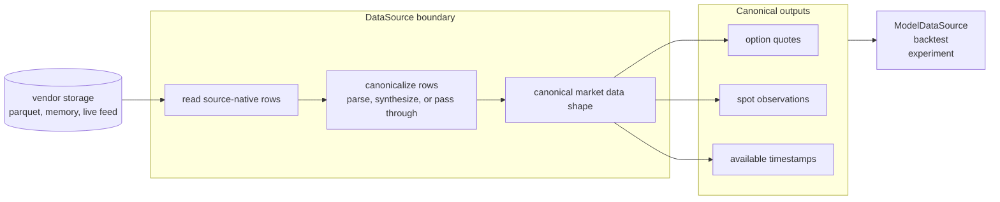

# `data` module

Defines the canonical raw-market records (`OptionQuote`, `SpotPrice`,
`Underlying`) and the `DataSource` boundary downstream layers read
through. Implementations may be in-memory fixtures, parquet-backed
historical stores, or future live feeds; callers depend on canonical
records, not vendor storage.

Sources that already store canonical records can pass them through.
Sources with vendor-specific rows adapt them first: Polygon OHLCV option
rows become `OptionBar`s and a source-selected `QuoteSynthesizer`
(concrete today: `SpreadFromOHLCV(lambda)`) emits `OptionQuote`s. A
future live bid/ask source may need no synthesizer.

## Data flow

Vendor storage details stay behind `DataSource`; downstream modules ask
for raw market observations in the repo's canonical shape.

## `DataSource` protocol

The protocol exposes time-indexed option quotes, spot observations, and
available timestamps in canonical record types. It does not expose
whether those records came from parquet rows, in-memory fixtures, or a
future live feed.

Sources may cache; `clear_cache!` is part of the protocol surface and
must invalidate any source-local cache.

Convention: `missing` is for absent scalar values or optional fields
inside a record (`spot`, `bid`, `ask`, `iv`, ...). `nothing` is for a
missing aggregate object (`chain`, later `surface`) where there is no
record to inspect.

## `ParquetDataSource`

### Responsibility boundaries

**Owns:** parquet path/layout resolution, lazy reads and caching,
vendor-row canonicalization, and mapping Polygon option/spot rows into
canonical records.

**Does NOT own:** data acquisition, pricing models, surface construction,
strategy schedules, or concurrent access.

A `ParquetDataSource` holds an open DuckDB connection: `close(ds)` it when
done (or use the scoped `with_parquet_source(...) do ds ... end` helper).
On Windows the file lock outlives GC, so relying on finalization alone can
leave the parquet store locked.

## Key decisions

| Decision | Why |
|---|---|
| **Bounded lazy cache** | Parquet-backed sources can be much larger than memory. Cache bounds keep historical reads predictable; sliding-window strategies can raise the limits when needed. |
| **Bounded timestamp discovery** | Unbounded discovery would silently scan the whole dataset. `ParquetDataSource` requires `(from, to)` until a collector-written timestamp index exists. |
| **Hive layout: `options_1min/` + `spots_1min/`, keyed by `symbol=<T>`** | Matches the `options-collector` output. Single-root construction derives both subdirs; explicit roots remain for non-standard layouts. |
| **Source declares its `QuoteSynthesizer`** | Polygon has only OHLCV, so bid/ask construction is part of source provenance. A future live-feed source can pass quotes through or use a different adapter. |
| **Ticker-underlying mismatch throws** | Path partitioning makes a foreign ticker a data-corruption signal. Silent skipping would hide bugs. |

## Schema mapping

Polygon option rows are normalized as `OptionBar`, then synthesized into
`OptionQuote`. Parsed contract columns from the collector are preferred
over ticker parsing; ticker parsing is the fallback. Spot rows map
directly to `SpotPrice`.

Missing scalar fields stay `missing`. Missing aggregate objects, such as
an absent option chain at a timestamp, return `nothing`. Malformed or
cross-underlying option rows throw.

Root directories are validated lazily on first read. This lets a
persisted `Experiment` be rehydrated on a machine whose local data store
lives elsewhere; the source only throws when data is actually accessed.

## Future work

- Collector-written timestamp index beside the parquet data, so
  `ParquetDataSource` can implement no-arg `available_timestamps(ds)`
  without scanning every option-chain file. The current producer would be
  the private [`options-collector`](https://github.com/aleCombi/options-collector)
  library.
- Concurrent-safe caching (lock or per-day stripes) before any
  multi-threaded backtest engine.
