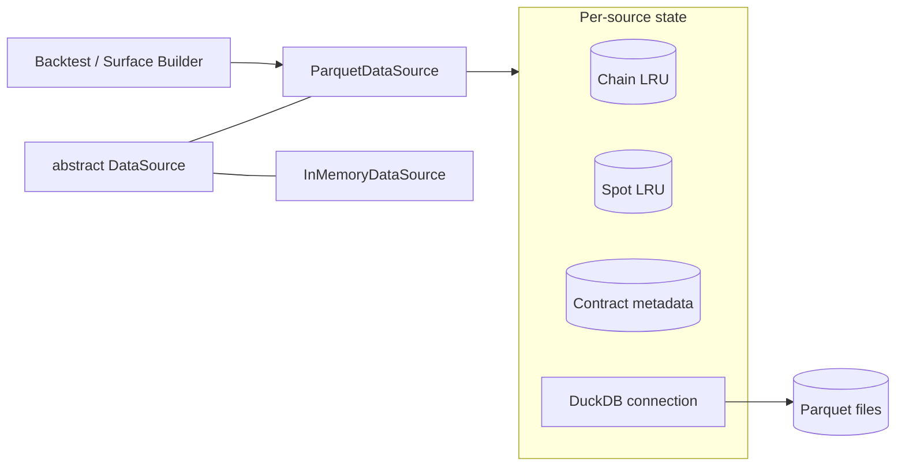

# `data` module

Defines the canonical record types (`OptionQuote`, `SpotPrice`, `Underlying`)
and the `DataSource` protocol every downstream layer reads through. Two
concrete implementations: `InMemoryDataSource` (tests, fixtures, small
workloads) and `ParquetDataSource` (lazy reads from a partitioned local
parquet store). Callers are written against the abstract type and don't
care which one they got.

## `DataSource` protocol

- `available_timestamps(ds)` — sorted timestamps with chains; only
  cheap-to-answer sources implement this. `ParquetDataSource` throws
  with a message pointing to the bounded form.
- `available_timestamps(ds, from, to)` — bounded form, canonical for
  lazy sources.
- `get_chain(ds, ts) :: Union{Vector{OptionQuote}, Nothing}`
- `get_spot(ds, ts) :: Union{Float64, Missing}`
- `get_spots(ds, from, to) :: Vector{SpotPrice}`
- `clear_cache!(ds)` — no-op default; lazy sources override.

Convention: `missing` means absent data, `nothing` means computation
failed / skip.

## `ParquetDataSource`

Reads Polygon-style options and spot parquet on demand, with bounded
memory and sequential-access-friendly caching.

### Responsibility boundaries

**Owns:** path resolution, column-projected DuckDB reads, ticker parsing,
per-day LRU caching, mapping rows to `OptionQuote` / `SpotPrice`.

**Does NOT own:**

- IV inversion or implied vol — leaves `iv = missing`.
- Synthetic bid/ask from OHLC — leaves `bid = ask = missing`.
- Surface construction, smoothing, filtering.
- Schedule / timeline ownership — callers ask for the timestamps they want.
- Data acquisition (Polygon API, network).
- Concurrency — single-threaded; reads mutate cache state.

The rule: this module turns parquet bytes into typed records, nothing more.
Pricing models, surfaces, and strategies are downstream concerns.

## Architecture

## Key decisions

| Decision | Why |
|---|---|
| **One calendar day per cache entry** | Backtests walk time forward; per-day amortizes a single DuckDB scan over hundreds of `get_chain` calls. |
| **LRU bound = `max_days_cached` (default 3)** | Hard memory ceiling. Sliding-window strategies should set this to their window size. |
| **Source-wide contract metadata cache** | A daily SPY parquet repeats every contract every minute (~390x). Parse-once-per-ticker is the difference between thousands and millions of regex matches. Never evicted; size is bounded by distinct contracts seen. |
| **Spot cache uses parallel `Vector{DateTime}` + `Vector{Float64}`** | Direct `searchsortedfirst` on timestamps; no broken `by` kwarg. Avoids per-row `Underlying` overhead. `SpotPrice` is materialized only for `get_spots` results. |
| **Row iteration via `Tables.rows`, no `DataFrame`** | Avoids materializing a full intermediate table; rows stream straight into `OptionQuote`. |
| **Column-projected SELECT, schema probed first** | Reads only `ticker, close, volume, timestamp` (chains) or `timestamp, close` (spots). DuckDB pre-validates column existence, so optional columns (e.g. `volume`) are checked via `parquet_schema()` before SELECT, not after. |
| **`available_timestamps(ds, from, to)` is bounded; no-arg form throws** | Unbounded discovery would silently scan the entire dataset. Bounded form reuses the chain cache for free. |
| **Hive layout: `options_1min/` + `spots_1min/`, both keyed by `symbol=<T>`** | Matches the `options-collector` output exactly. Single-root constructor `ParquetDataSource("AAPL", root)` derives both subdirs; explicit-roots constructor remains for non-standard layouts. |
| **Prefer `parsed_*` columns over ticker regex** | The collector already emits `parsed_underlying`, `parsed_expiry`, `parsed_strike`, `parsed_option_type` per row. When present, they're authoritative — saves one regex match per row and survives any ticker formats the collector handled but our parser doesn't. Ticker regex is the fallback. |
| **Ticker-underlying mismatch throws** | Path partitioning makes a foreign ticker an indicator of corrupt data, not legitimate input. Silent skipping would hide bugs. |
| **DuckDB connection per source, finalizer + `close(ds)`** | Reuses internal buffers across day loads. Explicit `close` exists because Windows file locks otherwise outlive GC. |

## Schema mapping (Polygon → `OptionQuote`)

`mark = close`. `bid`, `ask`, `iv`, `open_interest` are always `missing`.
`volume` is `missing` when the column is absent. `expiry`, `strike`,
`option_type` come from parsing the Polygon ticker (4 PM ET → UTC,
DST-aware via `TimeZones.jl`).

## Failure modes

| Condition | `get_chain` | `get_spot` | `get_spots` |
|---|---|---|---|
| Day file absent | `nothing` | `missing` | day skipped, range continues |
| Timestamp absent on present day | `nothing` | `missing` | excluded from range |
| Malformed Polygon ticker | throws | — | — |
| Ticker underlying ≠ source underlying | throws | — | — |
| `from > to` | — | — | empty |

`available_timestamps(ds)` (no-arg) throws with a message pointing to the
bounded form.

## Future work

- Sidecar timestamp manifest written by the collector → cheap discovery,
  unblocks no-arg `available_timestamps`.
- Concurrent-safe caching (lock or per-day stripes) — needed before any
  multi-threaded backtest engine.
- Pricing-layer wrapper that adds synthetic `bid`/`ask` and inverted `iv`,
  keeping this module purely a data accessor.
