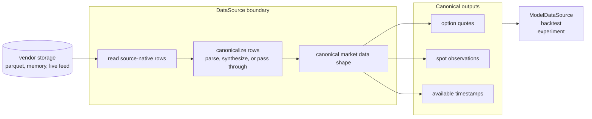

# `data` module

Defines the canonical record types (`OptionQuote`, `SpotPrice`, `Underlying`)
and the `DataSource` protocol every downstream layer reads through. Two
concrete implementations: `InMemoryDataSource` (tests, fixtures, small
workloads) and `ParquetDataSource` (lazy reads from a partitioned local
parquet store). Callers are written against the abstract type and don't
care which one they got.

Also owns a small adapter layer for sources whose underlying record is a
bar rather than a quote: `OptionBar` mirrors a Polygon OHLCV row and a
`QuoteSynthesizer` strategy (concrete: `SpreadFromOHLCV(λ)`) turns it
into an `OptionQuote`. The Polygon parquet store has no bid/ask feed,
so a data source built on it declares its synthesizer at construction
and consults it at row-load time. A future live-bid/ask source needs no
synthesizer at all -- the seam is the data source's choice, not a
hardcoded assumption downstream.

## Data flow

The point of the boundary is that vendor storage details stay behind
`DataSource`. Downstream modules ask for raw market observations in the
canonical repo shape; each source owns whatever parsing, synthesis, or
pass-through adaptation is needed to get there.

## `DataSource` protocol

The protocol is the raw-market-data boundary of the repo. It exposes
time-indexed option quotes and spot observations in canonical record
types (`OptionQuote`, `SpotPrice`) without leaking whether those records
came from parquet rows, in-memory fixtures, or a future live feed.
Sources that already store canonical records can pass them through;
sources with vendor-specific rows adapt them first. For Polygon OHLCV
option rows, that adaptation is `OptionBar` plus the source's declared
`QuoteSynthesizer`; other sources can use no synthesizer or a different
row adapter.

Accessors are intentionally small: discover timestamps, read option
chains, read spot observations, and clear any source-local cache.

Convention: `missing` is for absent scalar values or optional fields
inside a record (`spot`, `bid`, `ask`, `iv`, ...). `nothing` is for a
missing aggregate object (`chain`, later `surface`) where there is no
record to inspect.

## `ParquetDataSource`

Reads Polygon-style options and spot parquet on demand, with bounded
memory and sequential-access-friendly caching. Carries a
`QuoteSynthesizer` (required at construction) used to project each loaded
OHLCV row into the `OptionQuote` shape downstream code consumes.

Scoped reads can use `with_parquet_source(args...; kwargs...) do ds ... end`,
which constructs a `ParquetDataSource`, runs the callback, and closes the
source in a `finally` block.

### Responsibility boundaries

**Owns:** path resolution, column-projected DuckDB reads, ticker parsing,
per-day LRU caching, building an `OptionBar` per row and projecting it
through the declared `QuoteSynthesizer` into an `OptionQuote`, mapping
spot rows to `SpotPrice`.

**Does NOT own:**

- The synthesis *policy* itself — the data source declares which
  synthesizer it carries, but the math (`SpreadFromOHLCV` etc.) lives
  on the synthesizer type, swappable per source.
- IV inversion or implied vol — leaves `iv = missing`.
- Surface construction, smoothing, filtering.
- Schedule / timeline ownership — callers ask for the timestamps they want.
- Data acquisition (Polygon API, network).
- Concurrency — single-threaded; reads mutate cache state.

The rule: this module turns parquet bytes into typed records via a
declared synthesis policy, nothing more. Pricing models, surfaces, and
strategies are downstream concerns.

## Key decisions

| Decision | Why |
|---|---|
| **One calendar day per cache entry** | Backtests walk time forward; per-day amortizes a single DuckDB scan over hundreds of `get_chain` calls. |
| **LRU bound = `max_days_cached` (default 3)** | Hard memory ceiling. Sliding-window strategies should set this to their window size. |
| **Source-wide contract metadata cache** | A daily SPY parquet repeats every contract every minute (~390x). Parse-once-per-ticker is the difference between thousands and millions of regex matches. Never evicted; size is bounded by distinct contracts seen. |
| **Spot cache uses parallel `Vector{DateTime}` + `Vector{Float64}`** | Direct `searchsortedfirst` on timestamps; no broken `by` kwarg. Avoids per-row `Underlying` overhead. `SpotPrice` is materialized only for `get_spots` results. |
| **Row iteration via `Tables.rows`, no `DataFrame`** | Avoids materializing a full intermediate table; rows stream straight into `OptionQuote`. |
| **Column-projected SELECT, schema probed first** | Reads only `ticker, close, volume, timestamp` (chains) or `timestamp, close` (spots). DuckDB pre-validates column existence, so optional columns (e.g. `volume`) are checked via `parquet_schema()` before SELECT, not after. |
| **`available_timestamps(ds, from, to)` is bounded; no-arg form throws** | Unbounded discovery would silently scan the entire dataset. Bounded form reuses the chain cache for free. |
| **Hive layout: `options_1min/` + `spots_1min/`, both keyed by `symbol=<T>`** | Matches the `options-collector` output exactly. Single-root constructor `ParquetDataSource("AAPL", root; synthesizer=...)` derives both subdirs; explicit-roots constructor remains for non-standard layouts. |
| **Source declares its `QuoteSynthesizer` at construction (required kwarg)** | Polygon has only OHLCV; we have to invent bid/ask to fill anything. Making the policy part of the source's declaration (rather than a wrapper, a downstream default, or a backtest-engine knob) keeps it visible in every experiment record. A future live-feed source carries a passthrough (or skips the type entirely); a robustness sweep just constructs the same source with `SpreadFromOHLCV(0.0)` vs `(1.0)`. |
| **Prefer `parsed_*` columns over ticker regex** | The collector already emits `parsed_underlying`, `parsed_expiry`, `parsed_strike`, `parsed_option_type` per row. When present, they're authoritative — saves one regex match per row and survives any ticker formats the collector handled but our parser doesn't. Ticker regex is the fallback. |
| **Ticker-underlying mismatch throws** | Path partitioning makes a foreign ticker an indicator of corrupt data, not legitimate input. Silent skipping would hide bugs. |
| **DuckDB connection per source, finalizer + `close(ds)`** | Reuses internal buffers across day loads. Explicit `close` exists because Windows file locks otherwise outlive GC. Closed sources reject reads with `ArgumentError` instead of touching the closed DuckDB handle. |
| **`with_parquet_source` for scoped use** | Mirrors Julia's `open(...) do io` resource-management idiom. Scripts and short-lived reads should prefer it over manually pairing construction and `close`. |

## Schema mapping (Polygon → `OptionBar` → `OptionQuote`)

Per row, the loader builds an `OptionBar` carrying `open`, `high`, `low`,
`close`, `volume` (each `missing` when the column or value is absent),
then calls `synthesize(ds.synthesizer, bar)` to produce the
`OptionQuote` stored in the cache. With `SpreadFromOHLCV(λ)` this means
`mark = close`, and `bid`/`ask` are interpolated from `low`/`high`/`close`
via the synthesizer (or `missing` when any of the three OHLC inputs is
absent). `iv` and `open_interest` are always `missing`. `expiry`,
`strike`, `option_type` come from `parsed_*` columns when present,
otherwise from parsing the Polygon ticker (4 PM ET → UTC, DST-aware via
`TimeZones.jl`).

## Failure modes

| Condition | `get_chain` | `get_spot` | `get_spots` |
|---|---|---|---|
| Day file absent | `nothing` | `missing` | day skipped, range continues |
| Timestamp absent on present day | `nothing` | `missing` | excluded from range |
| Malformed Polygon ticker | throws | — | — |
| Ticker underlying ≠ source underlying | throws | — | — |
| Root directory missing | throws | throws | throws |
| `from > to` | — | — | empty |

Root directories are validated **lazily** on the first read, not at
construction. Constructing against a missing root emits a `@warn` and
returns a usable handle; the first `get_chain` / `get_spot` /
`get_spots` against the missing root throws. This lets a persisted
`Experiment` config be rehydrated in a workspace whose data store is
elsewhere without forcing the data to be present at load time.

`available_timestamps(ds)` (no-arg) throws with a message pointing to the
bounded form.

## Future work

- Collector-written timestamp index beside the parquet data, so
  `ParquetDataSource` can implement no-arg `available_timestamps(ds)`
  without scanning every option-chain file. The current producer would be
  the private [`options-collector`](https://github.com/aleCombi/options-collector)
  library.
- Concurrent-safe caching (lock or per-day stripes) — needed before any
  multi-threaded backtest engine.
- IV inversion on the synthesized quote (still `missing` today).
- Additional `QuoteSynthesizer` policies (e.g. a fixed-spread variant,
  or one that uses tick-size rounding) as experiments demand.
