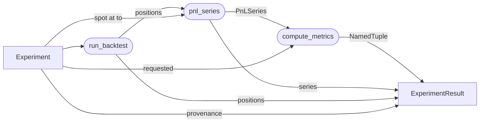

# `experiment` module

One-shot orchestrator: wires `(Agent, ModelDataSource, time window,
requested metrics)` into a single rerunnable record. Owns one
struct, one result wrapper, one entry point. Train / val / test
splits, refit cadence, and learning live inside the
[`Agent`](agents.md); the `Experiment` only sees the evaluation
window.

## Data flow



Per call to `run_experiment`: tick the engine, resolve a settlement
spot at the last available timestamp `<= exp.to`, aggregate the
ledger into a `PnLSeries`, compute always-on plus requested optional
metrics, and pack everything (including the originating `Experiment`)
into one `ExperimentResult`.

## The abstraction

```julia
struct OutputSpec
    metrics       :: Vector{Symbol}
    metric_params :: Dict{Symbol,NamedTuple}
    artifacts     :: Vector{Symbol}
end
OutputSpec(; metrics=<all registered>, metric_params=Dict(), artifacts=[:equity_curve])

struct Experiment
    name    :: String
    agent   :: Agent
    source  :: ModelDataSource
    from    :: DateTime
    to      :: DateTime
    outputs :: OutputSpec
end

Experiment(; name, agent, source, from, to, outputs=OutputSpec())

struct ExperimentResult
    experiment :: Experiment
    positions  :: Vector{Position}
    pnl_series :: PnLSeries
    metrics    :: NamedTuple
end

run_experiment(exp::Experiment) -> ExperimentResult
core_hash(exp) :: String   # backtest identity (source, agent, window)
full_hash(exp) :: String   # core + outputs; the run's id in the KB
```

`Experiment.outputs` declares what the run produces: optional metrics,
per-metric parameter overrides, and the artifacts to render. Omitted
fields default to *all* registered optional metrics and the default
artifact set -- metrics are cheap, so "all of them" is the sensible
default. Always-on core metrics (`:total_pnl`, `:n_round_trips`,
`:n_opens`, `:n_closes`, `:hit_rate`) always appear in `result.metrics`
regardless. Outputs are part of `full_hash` but not `core_hash`, so
changing them is a new run over the same backtest (see
[`persistence`](persistence.md)).

### Rerun

```julia
res  = run_experiment(exp)
res2 = run_experiment(res.experiment)   # same inputs, same result
```

The full `Experiment` rides in `ExperimentResult.experiment`, so a
single function call reproduces the run without needing the caller
to remember any other state.

### Train / val / test splits live on the Agent

`Experiment.(from, to)` is the *evaluation* window. Anything
sub-windowed (train on `[from, t_split]` and evaluate on
`[t_split, to]`, walk-forward refits inside the window, lookback
buffers warmed on data *before* `from`) is the `Agent`'s concern.
The Agent receives a `TimeCutModelDataSource` per tick whose `inner`
is the full `ModelDataSource` -- it can read history before `from`
freely, and only data strictly after the current tick is blocked.

## Key decisions

| Decision | Why |
|---|---|
| **`run_experiment`, not `run`** | `Base.run` is exported and dispatches on `Cmd`; shadowing it for a domain verb is exactly the convention warning every Julia style guide gives. `run_experiment` also reads as a peer of `run_backtest`. |
| **Result carries the full `Experiment`, not just `name`** | Rerun is the primary use case for provenance. `run_experiment(result.experiment)` is the obvious primitive; a bare `name` would force a sidecar registry to look up the rest. The cost is one cheap struct reference. |
| **Per-leg settlement, window-end spot for open residuals** | Each round-trip leg settles at its own `trade.expiry` via `get_spot`; legs whose expiry is past the window mark at the window-end spot (`get_spot(source, last_ts_in_window)`); legs whose expiry-time spot is missing count in `n_unmarked` rather than silently substituting a wrong number. |
| **Always-on metrics not in the output spec** | They are computed unconditionally and cost nothing extra. Listing them in `outputs.metrics` would force every experiment to repeat a boilerplate list and would imply they were opt-in, which they are not. |
| **`metrics::Vector{Symbol}`, not `Vector{Function}`** | Symbols survive serialization to disk (now exercised by the TOML config loader), read cleanly in config dumps, and let `compute_metrics` carry the per-symbol default kwargs in one place ([`compute_metrics`](metrics.md)). Function references would skip the table at the cost of looking less like a config artifact. |
| **Per-metric kwargs on `OutputSpec.metric_params`** | Non-default conventions (e.g. Sharpe at a different `risk_free`) ride in `OutputSpec.metric_params` (`Dict{Symbol,NamedTuple}`) and flow through `compute_metrics`'s `kwargs`. They are outputs, so they are part of `full_hash` but not `core_hash` -- a parameter change is a new run over the same backtest. |
| **Identity from the resolved experiment, not config bytes** | `full_hash` / `core_hash` are computed from `to_dict(exp)` over the *resolved* experiment (`identity.jl`), so identity is insensitive to how the config was spelled and separates outputs from the backtest. The [`persistence`](persistence.md) layer records them; it does not compute them. |
| **`run_experiment` errors loudly on missing data** | Empty time window or a missing settlement spot both indicate the experiment is mis-specified or the data source has gaps the caller did not expect. Silent zeros would invent a "result" that doesn't exist. |

## Responsibility boundaries

**Owns:** the `Experiment` / `OutputSpec` structs, the
`ExperimentResult` wrapper, the `run_experiment` entry point, the
per-leg settlement policy, and run identity (`core_hash` / `full_hash`
via `identity.jl`).

**Does NOT own:**

- Tick loop and fill semantics. That is the [backtest
  engine](backtest.md).
- Policy logic. That is the [`policies`](policies.md) module.
- Policy evolution / refit cadence / learning. That is the
  [`agents`](agents.md) module.
- Metric implementations and their dispatch table. That is the
  [`metrics`](metrics.md) module.
- Persistence and knowledge-base writes. That is the
  [`persistence`](persistence.md) module (`save_run` / `load_run`).
- Artifact rendering. Script-level (`scripts/lib/artifacts.jl`) so the
  core stays Plots-free.

## Failure modes

| Condition | Behavior |
|---|---|
| Empty time window (`available_timestamps(source, from, to)` empty) | `run_experiment` errors with the window and experiment name. |
| Settlement spot missing at the last in-window timestamp | `run_experiment` errors with the timestamp and experiment name. |
| `exp.outputs.metrics` contains an unknown symbol | `compute_metrics` errors with the offending symbol and the known list. |
| Agent / Policy never trades | `result.positions` and `result.pnl_series.pnl` are empty; always-on metrics are `0.0` / `0` / `NaN` per their empty-series conventions. |
| Spot present but no fills happened | Settlement spot is recorded on `pnl_series` even when unused -- harmless and keeps the field non-optional. |

## Config loading

A TOML file resolves to an `Experiment` via `load_experiment(path)`.
Schema is a flat header (`name`, `from`, `to`) plus nested tables:
`[source]`, `[agent]`, and an optional `[outputs]`. Every sum-type
(`DataSource`, `Curve`, `QuoteSynthesizer`, `Policy`, `Agent`) is keyed
by a string `type` discriminator; the rest of that table is forwarded to
the matching builder. `[outputs]` lists `metrics` / `artifacts` plus
per-metric `[outputs.metric_params.<m>]`; omitted, it defaults to all
metrics and the default artifacts. Legacy top-level `metrics` is rejected
with a clear error; metrics must live under `[outputs]`.

```toml
name = "noop_smoke"
from = 2024-01-16T14:30:00
to   = 2024-01-16T14:35:00

[outputs]                      # optional; omit for all-metrics defaults
metrics = ["sharpe", "max_drawdown"]

[source]
type       = "parquet"
underlying = "SPY"
root       = "C:/data/polygon"

[source.synthesizer]
type   = "ohlcv_spread"
lambda = 0.7

[source.rate]
type  = "flat"
value = 0.04

[source.div]
type  = "flat"
value = 0.015

[agent]
type = "static"

[agent.policy]
type = "noop"
```

New concrete types register themselves by adding one entry to the
relevant builder table (`_DATA_SOURCE_BUILDERS`, `_CURVE_BUILDERS`,
`_SYNTHESIZER_BUILDERS`, `_POLICY_BUILDERS`, `_AGENT_BUILDERS`) -- same
pattern as `_METRIC_TABLE` in [`metrics`](metrics.md). A new sum-type
also needs a `to_dict` method (`identity.jl`) so it contributes to the
run hashes.

Run from the CLI:

```
julia --project=. scripts/run_experiment.jl configs/noop_smoke.toml
julia --project=. scripts/run_experiment.jl configs/noop_smoke.toml --save
julia --project=. scripts/run_experiment.jl configs/noop_smoke.toml --out-dir C:/tmp
```

Bare prints the result via `Base.show`. `--save` persists it to the
knowledge base (`scripts/runs/`, gitignored) with code provenance and
renders the output artifacts there; `--out-dir` renders artifacts to a
scratch dir without persisting.

## Future work

- Compute reuse: when a new experiment's `core_hash` matches a stored
  run produced by the same code, load its `pnl_series` and recompute
  only the outputs instead of re-running the backtest.
- A curation gate over the knowledge base (draft / accept / retract).
- Parallel sweeps: an `experiments::Vector{Experiment}` runner that
  parallelizes across runs (the engine is single-threaded; the
  parallelism layer is here).
- Live-trading sibling: same `Experiment` shape with `run_backtest`
  swapped for a live loop driver.

## Layout

```
src/experiment/
    experiment.jl     # Experiment + OutputSpec + ExperimentResult + run_experiment
    identity.jl       # to_dict projection + core_hash / full_hash
    show.jl           # Base.show(::IO, ::MIME"text/plain", ::ExperimentResult)
    config.jl         # load_experiment + builder registries (incl. [outputs])

configs/              # versioned TOML experiment configs
    noop_smoke.toml

scripts/
    run_experiment.jl # CLI: load -> run -> show [--save] [--out-dir]
    lib/artifacts.jl  # script-level artifact renderers (Plots)

test/experiment/
    test_experiment.jl
    test_config.jl
    test_identity.jl
```

All `src/experiment/*.jl` files are `include`d into the top-level
`VolSurfaceAnalysis` module; no submodule wrappers.
