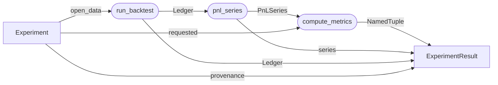

# `experiment` module

One-shot orchestrator: wires `(Agent, MarketData specs, Clock, time
window, requested metrics)` into a single rerunnable record. Owns one
struct, one result wrapper, one entry point. Train / val / test
splits, refit cadence, and learning live inside the
[`Agent`](agents.md); the `Experiment` only sees the evaluation
window.

## Data flow


```mermaid
flowchart LR
    Exp[Experiment] -->|open_data| RB([run_backtest])
    RB -->|Ledger| PS([pnl_series])
    PS -->|PnLSeries| CM([compute_metrics])
    Exp -->|requested| CM
    CM -->|NamedTuple| ER[ExperimentResult]
    PS -->|series| ER
    RB -->|Ledger| ER
    Exp -->|provenance| ER
```

Per call to `run_experiment`: open the data (`with_data`), tick the
engine on the clock through the experiment's own venue, check that the window
holds a clock tick, build the `PnLSeries` from the ledger's round trips,
compute always-on plus requested optional metrics, close the data, and
pack everything (including the originating `Experiment`) into one
`ExperimentResult`. Everything that touches readers runs inside
`with_data`; the `Experiment` itself holds specs only. Open lots at the
window end stay open and contribute nothing until the equity curve of
slice 5 marks them; nothing is force-settled, and expiries inside the
window are booked by the engine's lifecycle step.

## The abstraction

```julia
struct OutputSpec
    metrics       :: Vector{Symbol}
    metric_params :: Dict{Symbol,NamedTuple}
    artifacts     :: Vector{Symbol}
end
OutputSpec(; metrics=<all registered>, metric_params=Dict(), artifacts=[:equity_curve])

struct Experiment
    name       :: String
    agent      :: Agent
    data       :: MarketData   # provider specs, one per kind; opened per run
    clock      :: Clock        # tick grid: kind + selector; core identity
    from       :: DateTime
    to         :: DateTime
    fill_rule  :: Symbol       # venue choice: how a quote becomes a leg price
    cost_model :: Symbol       # venue choice: what an order costs
    outputs    :: OutputSpec
end

Experiment(; name, agent, data, clock, from, to,
             fill_rule=:cross_spread, cost_model=:ibkr_pro_us_options,
             outputs=OutputSpec())

struct ExperimentResult
    experiment :: Experiment
    ledger     :: Ledger          # events and the order journal
    pnl_series :: PnLSeries
    metrics    :: NamedTuple
end

run_experiment(exp::Experiment) -> ExperimentResult
core_hash(exp) :: String   # backtest identity (data, clock, agent, window,
                           #                    venue, resolved contract facts)
full_hash(exp) :: String   # core + outputs; the run's id in the KB
```

`Experiment.outputs` declares what the run produces: optional metrics,
per-metric parameter overrides, and the artifacts to render. Omitted
fields default to *all* registered optional metrics and the default
artifact set -- metrics are cheap, so "all of them" is the sensible
default. Always-on core metrics (`:total_pnl`, `:n_round_trips`,
`:n_opens`, `:n_closes`, `:hit_rate`) always appear in `result.metrics`
regardless. Outputs are part of `full_hash` but not `core_hash`, so
changing them is a new run over the same backtest (see
[`persistence`](persistence.md)).

### Rerun

```julia
res  = run_experiment(exp)
res2 = run_experiment(res.experiment)   # same inputs, same result
```

The full `Experiment` rides in `ExperimentResult.experiment`, so a
single function call reproduces the run without needing the caller
to remember any other state.

### Train / val / test splits live on the Agent

`Experiment.(from, to)` is the *evaluation* window. Anything
sub-windowed (train on `[from, t_split]` and evaluate on
`[t_split, to]`, walk-forward refits inside the window, lookback
buffers warmed on data *before* `from`) is the `Agent`'s concern.
The Agent receives a `TimeCut` per tick over the full reader map --
it can read history before `from` freely, and only data strictly after
the current tick is blocked.

## Key decisions

| Decision | Why |
|---|---|
| **`run_experiment`, not `run`** | `Base.run` is exported and dispatches on `Cmd`; shadowing it for a domain verb is exactly the convention warning every Julia style guide gives. `run_experiment` also reads as a peer of `run_backtest`. |
| **Result carries the full `Experiment`, not just `name`** | Rerun is the primary use case for provenance. `run_experiment(result.experiment)` is the obvious primitive; a bare `name` would force a sidecar registry to look up the rest. The cost is one cheap struct reference. |
| **The result carries the ledger, not a fill vector** | The ledger is the run: events with declared intent and recorded lineage, plus what every decision saw. The series and the metrics are derived from it and can be recomputed; nothing in the result is a second copy that could disagree with it. |
| **Open lots at the window end stay open** | Proposal decision 8: nothing is force-settled at `exp.to`. A lot still open contributes nothing to the realized series until the equity curve marks it at the evaluation endpoint (slice 5); expiries inside the window are lifecycle events, booked in the tick loop. The window-end spot lookup and its error are gone with the settle closure. |
| **The venue's two choices are fields, not keywords** | `fill_rule` and `cost_model` change results, so they must be visible to the run id; they are `Experiment` fields, in `core_hash`, and `run_experiment` still takes no keyword. The other two values that used to ride as engine keywords are not choices: the tick is the constant `TICK_CENTS`, and settlement style is a contract fact routed per lot off `contract_spec`. Two symbols, not a `VenueSpec` -- a struct would name the same two things twice. |
| **The resolved contract spec is in `core_hash`, the table is not** | `_CONTRACT_TABLE`'s facts reach cash through `contract_spec`, so a correction there must be a new run id. Only the spec for the experiment's one underlying is projected: projecting the table would fork every id on an unrelated entry. |
| **The clock underlying and a declared policy underlying must agree** | One experiment, one underlying is the real invariant here, and it is asserted rather than assumed: `_experiment_underlying` errors when `declared_underlyings(agent)` is non-empty and does not contain the clock selector. The loader, identity and the runner all come through it, because `Experiment` is a public constructor and a config is not the only way to build one -- identity projects the clock underlying's contract facts, so a directly-built experiment whose policy traded another would be hashed against the wrong multiplier. The id must not exist rather than be wrong. A clock is a tick grid; its selector answers *when* to step, not *whose price*: fills resolve per leg against the leg's own underlying. A policy that chooses its underlying per tick declares nothing and is not checked. |
| **Specs in, readers scoped to the run** | `Experiment.data` holds pure spec values (hashable, persistable); `run_experiment` opens them with `with_data` and closes them on every exit path. Rehydrating a saved run needs no data on disk until it is actually run. |
| **Always-on metrics not in the output spec** | They are computed unconditionally and cost nothing extra. Listing them in `outputs.metrics` would force every experiment to repeat a boilerplate list and would imply they were opt-in, which they are not. |
| **`metrics::Vector{Symbol}`, not `Vector{Function}`** | Symbols survive serialization to disk (now exercised by the TOML config loader), read cleanly in config dumps, and let `compute_metrics` carry the per-symbol default kwargs in one place ([`compute_metrics`](metrics.md)). Function references would skip the table at the cost of looking less like a config artifact. |
| **Per-metric kwargs on `OutputSpec.metric_params`** | Non-default conventions (e.g. Sharpe at a different `risk_free`) ride in `OutputSpec.metric_params` (`Dict{Symbol,NamedTuple}`) and flow through `compute_metrics`'s `kwargs`. They are outputs, so they are part of `full_hash` but not `core_hash` -- a parameter change is a new run over the same backtest. |
| **Identity from the resolved experiment, not config bytes** | `full_hash` / `core_hash` are computed from `to_dict(exp)` over the *resolved* experiment (`identity.jl`), so identity is insensitive to how the config was spelled and separates outputs from the backtest. The [`persistence`](persistence.md) layer records them; it does not compute them. |
| **`run_experiment` errors loudly on a mis-specified run** | No clock tick in the window, or a clock whose selector is not an `Underlying` (an experiment ticks on an underlying's grid), indicates the experiment is mis-specified. Silent zeros would invent a "result" that doesn't exist. A leg the venue cannot price is the engine's named failure. |

## Responsibility boundaries

**Owns:** the `Experiment` / `OutputSpec` structs, the
`ExperimentResult` wrapper, the `run_experiment` entry point, and run
identity (`core_hash` / `full_hash` via `identity.jl`).

**Does NOT own:**

- Tick loop and fill semantics. That is the [backtest
  engine](backtest.md).
- Policy logic. That is the [`policies`](policies.md) module.
- Policy evolution / refit cadence / learning. That is the
  [`agents`](agents.md) module.
- Metric implementations and their dispatch table. That is the
  [`metrics`](metrics.md) module.
- Persistence and knowledge-base writes. That is the
  [`persistence`](persistence.md) module (`save_run` / `load_run`).
- Artifact rendering. Script-level (`scripts/lib/artifacts.jl`) so the
  core stays Plots-free.

## Failure modes

| Condition | Behavior |
|---|---|
| No clock tick in `[from, to]` | `run_experiment` errors with the window and experiment name. |
| The clock's selector is not an `Underlying` | `run_experiment` errors: an experiment ticks on an underlying's grid. |
| A leg the venue cannot honestly price (no quote, no executable side, no spot at the tick) | `UnpriceableLeg` from the engine before anything is written; nothing serving an underlying is `UnservedSelector`. |
| A declared policy underlying differs from the clock selector | `load_experiment` errors naming both. |
| The clock's underlying settles in a style no rule serves | `load_experiment` errors naming the underlying and its style; a config that cannot be run fails when it is read, not hours into a backtest. |
| `[venue]` names an unknown fill rule or cost model, or an unknown key | `load_experiment` errors naming the known ones. A typo would otherwise take the default silently and fork the run id from the intent. |
| Data root missing on this machine | `open_data` throws `ArgumentError` at the start of the run; loading the config succeeds. |
| `exp.outputs.metrics` contains an unknown symbol | `compute_metrics` errors with the offending symbol and the known list. |
| Agent / Policy never trades | `result.ledger` is empty with no orders and `result.pnl_series.pnl` is empty; always-on metrics are `0.0` / `0` / `NaN` per their empty-series conventions. |
| Lots still open at the window end | They stay open in `book_effective(result.ledger, exp.to)` and contribute no sample; `window_end_spot` is `NaN` and `n_unmarked` is `0` until slice 5 retires both. |

## Config loading

A TOML file resolves to an `Experiment` via `load_experiment(path)`.
Schema: a flat header (`name`, `from`, `to`, `clock`) plus nested
tables: one `[data.<kind>]` table per kind, `[agent]`, and optional
`[outputs]` and `[venue]` tables. Every sum-type (data provider, `Curve`, `QuoteSynthesizer`,
`Policy`, `Agent`) is keyed by a string `type` discriminator; the rest
of that table is forwarded to the matching builder. `[outputs]` lists
`metrics` / `artifacts` plus per-metric `[outputs.metric_params.<m>]`;
omitted, it defaults to all metrics and the default artifacts. The old
top-level `metrics` and the old `[source]` table are rejected with a
pointer here.

```toml
name  = "noop_smoke"
from  = 2024-01-16T14:30:00
to    = 2024-01-16T14:35:00
clock = { kind = "option_quote", underlying = "SPY" }

[outputs]                      # optional; omit for all-metrics defaults
metrics = ["sharpe", "max_drawdown"]

[venue]                        # optional; both keys optional
fill_rule  = "cross_spread"
cost_model = "ibkr_pro_us_options"

[data.option_bar]
type = "parquet_option_bars"
root = "C:/data/polygon/options_1min"

[data.option_quote]
type = "from_bars"
synthesizer = { type = "ohlcv_spread", lambda = 0.7 }

[data.spot_price]
type = "parquet_spots"
root = "C:/data/polygon/spots_1min"

[data.rate_curve]
type = "constant"
currency = "USD"
value = 0.04                   # or curve = { type = "pc", knots = [...], values = [...] }

[data.div_curve]
type = "constant"
underlying = "SPY"
value = 0.015

[data.vol_surface]
type = "surface_from"
currency = "USD"
# spot_for = { SPY = "SPX" }   # optional remap of the pricing spot

[agent]
type = "static"

[agent.policy]
type = "noop"
```

The loader owns the only string-to-kind table:

| table name | kind | provider types |
|---|---|---|
| `option_bar` | `OptionBar` | `parquet_option_bars` |
| `option_quote` | `OptionQuote` | `from_bars` |
| `spot_price` | `SpotPrice` | `parquet_spots` |
| `rate_curve` | `RateCurve` | `constant` (`currency`) |
| `div_curve` | `DivCurve` | `constant` (`underlying`) |
| `vol_surface` | `VolatilitySurface` | `surface_from` (`currency`, optional `spot_for`, optional `lookback_ticks`) |

`[venue]` holds the two execution values that are choices rather than
facts; both default to the engine's own, so an omitted table and one that
spells the defaults out are the same experiment and the same run id. It
rejects unknown keys for the reason `surface_from` does. The class's tick
and the settlement rule are deliberately not there: the tick is the
constant `TICK_CENTS`, and settlement style comes from `contract_spec`.

`by_selector` composes any kind: every key other than `type` is a
selector naming a sub-table (`SPY = { type = "parquet_spots", root =
... }`). The clock's selector key follows its kind (`underlying` or
`currency`).

Load-time checks, each with a clear message: every table name is a
known kind; the built spec serves that kind; every derived spec's input
kinds are present; every spec has a lifecycle pair; every selector a
derived spec `demands` statically is one the map `serves`; the clock's
kind has a table and its selector has the right type.

The selector-demand check is a **fast path, not the mechanism**. A
mistyped currency on a `vol_surface` table then fails in a second rather
than after a backtest has been running, but the guarantee comes from
`serves` in the four map-level shapes (see
[`market_data`](market_data.md)). It skips providers that answer
`missing`, which is what keeps it off the filesystem: a parquet spec
cannot answer until it is opened, so a config is never validated by
probing a data root. Cache sizes are
`open_data` kwargs, never config, never identity; the data roots *are*
identity (the reserved `dataset` slot of the parquet specs), so the
same config on a machine with the data elsewhere is a distinct run.

A spec field that changes *which records a policy sees* is identity, and
`lookback_ticks` on `surface_from` is one: it decides how far back `asof`
walks for a surface, so it changes results. It is emitted by `to_dict`
always, not omitted when it takes its default -- identity is projected
from the resolved experiment, and the omit-when-default trick on
`Constant`'s visibility stamp is a documented exception, not the house
style. Consequence: rerunning an existing config that has a
`[data.vol_surface]` table produces a new `run_id`, so it lands beside
the old run rather than replacing it. `[data.vol_surface]` is also the
one `[data.*]` table that rejects unknown keys (`[venue]` does too),
because a typo there would take the default silently and fork identity
from intent.

New concrete types register themselves by adding one entry to the
relevant builder table (`_PROVIDER_BUILDERS`, `_CURVE_BUILDERS`,
`_SYNTHESIZER_BUILDERS`, `_POLICY_BUILDERS`, `_AGENT_BUILDERS`) -- same pattern as
`_METRIC_TABLE` in [`metrics`](metrics.md). A new sum-type also needs a
`to_dict` method (`identity.jl`) so it contributes to the run hashes; a
new provider spec needs `kind`, `inputs` (if derived), a lifecycle
pair, and its `to_dict`; a closed-world provider also needs `serves` and
`served_description`, and a derived spec that names selectors in its own
configuration should implement `demands`.

Run from the CLI:

```
julia --project=. scripts/run_experiment.jl configs/noop_smoke.toml
julia --project=. scripts/run_experiment.jl configs/noop_smoke.toml --save
julia --project=. scripts/run_experiment.jl configs/noop_smoke.toml --out-dir C:/tmp
```

Bare prints the result via `Base.show`. `--save` persists it to the
knowledge base (`scripts/runs/`, gitignored) with code provenance and
renders the output artifacts there; `--out-dir` renders artifacts to a
scratch dir without persisting.

## Future work

- Compute reuse: when a new experiment's `core_hash` matches a stored
  run produced by the same code, load its `pnl_series` and recompute
  only the outputs instead of re-running the backtest.
- A curation gate over the knowledge base (draft / accept / retract).
- Parallel sweeps: an `experiments::Vector{Experiment}` runner that
  parallelizes across runs (the engine is single-threaded; the
  parallelism layer is here).
- Live-trading sibling: same `Experiment` shape with `run_backtest`
  swapped for a live loop driver.

## Layout

```
src/experiment/
    experiment.jl     # Experiment + OutputSpec + ExperimentResult + run_experiment
    identity.jl       # to_dict projection + core_hash / full_hash
    show.jl           # Base.show(::IO, ::MIME"text/plain", ::ExperimentResult)
    config.jl         # load_experiment + builder registries (incl. [outputs])

configs/              # versioned TOML experiment configs
    noop_smoke.toml

scripts/
    run_experiment.jl # CLI: load -> run -> show [--save] [--out-dir]
    lib/artifacts.jl  # script-level artifact renderers (Plots)

test/experiment/
    test_experiment.jl
    test_config.jl
    test_identity.jl
```

All `src/experiment/*.jl` files are `include`d into the top-level
`VolSurfaceAnalysis` module; no submodule wrappers.
