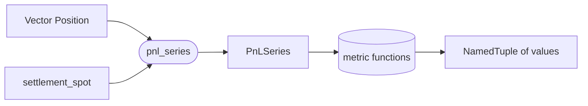

# `metrics` module

Pure functions over a canonical per-round-trip PnL intermediate
([`PnLSeries`](@ref)) built from a backtest's `Vector{Position}`
ledger. No `Metric` abstract type, no registry trait, no IO --
metrics are ordinary functions, and `compute_metrics` (added later
in this module's growth) dispatches a small symbol table of
optional ones.

## Data flow



The ledger goes through one aggregation pass (`pnl_series`); every
metric then reads from the resulting `PnLSeries`. That single pass
owns the open / close round-trip pairing so no downstream metric
has to know the engine records closes as counter-trades.

## The canonical intermediate

```julia
struct PnLSeries
    timestamps::Vector{DateTime}
    pnl::Vector{Float64}
    settlement_spot::Float64
    n_opens::Int
    n_closes::Int
end

pnl_series(positions::AbstractVector{Position}, settlement_spot::Real;
           settlement_timestamp::Union{DateTime,Nothing}=nothing) -> PnLSeries
```

A "round trip" is either:

- an open lot fully matched (FIFO) by one or more closing counter-trades
  on the same contract -- one entry per matched chunk, timestamped at
  the close fill, PnL `= (-_unit_cost(open) - _unit_cost(close)) * qty`; or
- an open lot still outstanding at the end of the ledger -- one entry
  per residual chunk, marked to `settlement_spot`, PnL
  `= (_unit_payoff(open, settlement_spot) - _unit_cost(open)) * qty`,
  timestamped at `settlement_timestamp` (or the leg's expiry if no
  timestamp was supplied).

Direction sequence is permissive: any fill that doesn't match
opposing lots becomes a new lot on its own side. The metrics layer
cannot tell a "first short open" from an "orphan close" -- the
ledger has no such marking -- so neither is special-cased, and a
"flip-over" close (one that exceeds the opposing open quantity)
closes what it can and leaves the residual as a fresh open on its
own side.

### Derived views

```julia
equity_curve(series::PnLSeries) -> Vector{Float64}
```

`cumsum(series.pnl)`. Empty input returns an empty vector.

## Key decisions

| Decision | Why |
|---|---|
| **Pure functions, no `Metric` trait** | Metrics are just functions over a `PnLSeries`. A registry / abstract `Metric` type would add ceremony without buying polymorphism we need; the symbol table (added next) gives "select-by-name" without baking it into a type hierarchy. |
| **`PnLSeries` carries timestamps and raw counts, not just `Vector{Float64}`** | Sharpe-with-annualization wants a per-trade time index; max-drawdown wants the equity curve in time order; `n_opens` / `n_closes` are not derivable from `pnl` alone (still-open residuals diverge from closed round trips). A slightly richer struct buys all of those without rework. |
| **Round-trip aggregation, not per-fill** | The backtest engine records closes as counter-trade `Position` rows whose own `realized_pnl(p, spot)` is the *payoff of the close leg*, not its contribution to a round trip. Summing per-fill would double-count. The intermediate sits one layer above and emits one number per round trip plus one per still-open residual. |
| **FIFO lot matching** | The accounting default. Doesn't affect `total_pnl`, but is the right convention for per-round-trip PnL and the close-fill timestamps the equity curve carries. |
| **Settlement spot supplied by the caller** | The metrics layer doesn't know about `ModelDataSource` or experiment windows; it gets a `Float64` and applies it to residuals. The orchestrator that knows the window end (`Experiment.to`) resolves the spot and passes it down. |
| **`settlement_timestamp` is optional and falls back to leg expiry** | The orchestrator passes its window end so residual marks are honestly stamped "mark-to-spot at `exp.to`". Hand-built fixtures and ad-hoc scripts can omit it and get the leg's expiry, which is the obvious unsupervised default. |

## Responsibility boundaries

**Owns:** `PnLSeries`, the round-trip aggregation logic, derived
read-only views like `equity_curve`. Will own (added in later
commits) individual metric functions and the symbol-dispatch
`compute_metrics` entry point.

**Does NOT own:**

- Ledger construction. That is the [backtest engine](backtest.md).
- Settlement-spot resolution. That is the [experiment
  orchestrator](experiment.md), once landed.
- Persistence, plotting, reporting. Downstream layers.

## Failure modes

| Condition | Behavior |
|---|---|
| Empty ledger | `pnl_series` returns an empty `PnLSeries`; `equity_curve` returns empty. |
| Closing fill with no opposing open lot | Treated as opening a fresh lot on its own side -- the layer can't tell intent from a single fill direction. |
| Closing fill that exceeds the opposing open quantity | Closes what it can and leaves the residual as a fresh open on its own side. |
| Mixed open / close fills on the same contract out of timestamp order | Sorted internally; original ledger order is not required. |

## Future work

- Always-on metric functions and a symbol-dispatch
  `compute_metrics(series, requested; kwargs)` entry point (next commits).
- Per-contract metric views (Sharpe / win-rate broken out by
  underlying or expiry bucket).
- Resampling to a regular time grid for return-based metrics
  whose semantics require uniform sampling.

## Layout

```
src/metrics/
    pnl_series.jl   # PnLSeries struct + pnl_series + equity_curve

test/metrics/
    test_pnl_series.jl
```

All files are `include`d into the top-level `VolSurfaceAnalysis`
module; no submodule wrappers.
