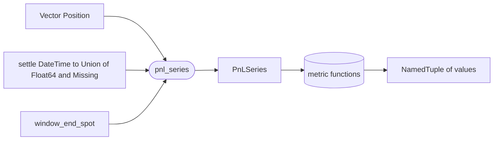

# `metrics` module

Pure functions over a canonical per-round-trip PnL intermediate
([`PnLSeries`](@ref)) built from a backtest's `Vector{Position}`
ledger. No `Metric` abstract type, no registry trait, no IO --
metrics are ordinary functions, and [`compute_metrics`](@ref)
dispatches a small symbol table of optional ones on top of a fixed
always-on core set.

## Data flow



The ledger goes through one aggregation pass (`pnl_series`); every
metric then reads from the resulting `PnLSeries`. That single pass
owns the open / close round-trip pairing so no downstream metric
has to know the engine records closes as counter-trades.

## The canonical intermediate

```julia
struct PnLSeries
    timestamps::Vector{DateTime}
    pnl::Vector{Float64}
    window_end_spot::Float64
    n_opens::Int
    n_closes::Int
    n_unmarked::Int
end

pnl_series(positions::AbstractVector{Position};
           settle::Function,
           window_end_spot::Real) -> PnLSeries
```

A "round trip" is either:

- an open lot fully matched (FIFO) by one or more closing counter-trades
  on the same contract -- one entry per matched chunk, timestamped at
  the close fill, PnL `= (-_unit_cost(open) - _unit_cost(close)) * qty`; or
- an open lot still outstanding at the end of the ledger -- one entry
  per residual chunk. The caller-supplied `settle(expiry)` closure
  decides the per-leg spot:
  - if `settle` returns a `Float64`, the entry is stamped at the leg's
    `trade.expiry` with PnL `= (_unit_payoff(open, s) - _unit_cost(open)) * qty`;
  - if `settle` returns `missing`, the lot is skipped and
    `n_unmarked` is incremented. The metrics layer never falls back to
    a wrong number -- the closure is the single source of truth for
    "can this leg honestly be priced?"

`window_end_spot` is recorded on the series for provenance (the spot
the orchestrator chose to use for case-1 marks inside its `settle`
closure). The metrics layer itself never uses it for any computation.

Direction sequence is permissive: any fill that doesn't match
opposing lots becomes a new lot on its own side. The metrics layer
cannot tell a "first short open" from an "orphan close" -- the
ledger has no such marking -- so neither is special-cased, and a
"flip-over" close (one that exceeds the opposing open quantity)
closes what it can and leaves the residual as a fresh open on its
own side.

### Derived views

```julia
equity_curve(series::PnLSeries) -> Vector{Float64}
```

`cumsum(series.pnl)`. Empty input returns an empty vector.

## Always-on metrics

Cheap, unparameterized, universally interesting. The orchestrator
computes these unconditionally on every call -- they are not listed
in `Experiment.metrics`, because that field is for opt-in optional
metrics with kwargs.

| Function | Returns | Empty-series behavior |
|---|---|---|
| `total_pnl(series)` | `Float64` | `0.0` |
| `n_round_trips(series)` | `Int` | `0` |
| `hit_rate(series)` | `Float64` | `NaN` |

`hit_rate` returns `NaN` (not `0.0`) on an empty series because hit
rate is genuinely undefined with no trades; `NaN` propagates honestly
through downstream math instead of silently reading as "0% wins."
`hit_rate` counts strictly positive PnL -- breakeven trades (PnL
exactly zero) are not wins.

`series.n_opens` and `series.n_closes` are exposed as struct fields,
not as separate metric functions, because they already live on
`PnLSeries` and adding `n_opens(series)` would be a one-line
forwarder that earns nothing. They appear under `:n_opens` and
`:n_closes` keys in the `compute_metrics` result.

## Optional metrics

Symbol-addressable, kwarg-carrying, opt-in. The `Experiment`
orchestrator passes its `metrics::Vector{Symbol}` straight through
to [`compute_metrics`](@ref), so the public symbol *is* the contract.

| Symbol | Function | Default kwargs | Returns | Empty-series behavior |
|---|---|---|---|---|
| `:sharpe`        | `sharpe(series; ...)`        | `(periods_per_year=252, risk_free=0.0)` | `Float64` | `NaN` (also `NaN` on zero variance or <2 trades) |
| `:sortino`       | `sortino(series; ...)`       | `(periods_per_year=252, risk_free=0.0)` | `Float64` | `NaN` (also `NaN` when no downside or zero downside deviation) |
| `:max_drawdown`  | `max_drawdown(series)`       | -- | `Float64` (peak-to-trough cash drop, always ≥ 0) | `0.0` |
| `:volatility`    | `volatility(series; ...)`    | `(periods_per_year=252,)` | `Float64` (annualized std of pnl) | `NaN` |
| `:profit_factor` | `profit_factor(series)`      | -- | `Float64` (gross wins / gross losses, or `Inf` when no losses) | `NaN` (also on all-breakevens) |

Sampling convention: each round trip is one observation. Sharpe,
Sortino, and volatility annualize by multiplying by
`sqrt(periods_per_year)` under the assumption that `periods_per_year`
round trips occur per year. Callers whose trade cadence differs
override the default 252 via the kwargs path below.

## Dispatch

```julia
compute_metrics(series::PnLSeries, requested::Vector{Symbol}=Symbol[];
                kwargs::AbstractDict{Symbol,<:NamedTuple}=Dict{Symbol,NamedTuple}())
    -> NamedTuple
```

Returns a `NamedTuple` whose keys are the always-on core names first
(in fixed order: `:total_pnl`, `:n_round_trips`, `:n_opens`,
`:n_closes`, `:hit_rate`), followed by every symbol in `requested`,
in the order given.

`kwargs` is a per-metric override map. Each entry merges with the
default kwargs baked into the metric's dispatch-table entry, so a
partial override (`Dict(:sharpe => (periods_per_year=12,))`) keeps
the rest of that metric's defaults. Unknown symbols error loudly with
the list of known names.

## Key decisions

| Decision | Why |
|---|---|
| **Pure functions, no `Metric` trait** | Metrics are just functions over a `PnLSeries`. A registry / abstract `Metric` type would add ceremony without buying polymorphism we need; the symbol table (added next) gives "select-by-name" without baking it into a type hierarchy. |
| **`PnLSeries` carries timestamps and raw counts, not just `Vector{Float64}`** | Sharpe-with-annualization wants a per-trade time index; max-drawdown wants the equity curve in time order; `n_opens` / `n_closes` are not derivable from `pnl` alone (still-open residuals diverge from closed round trips). A slightly richer struct buys all of those without rework. |
| **Round-trip aggregation, not per-fill** | The backtest engine records closes as counter-trade `Position` rows whose own `realized_pnl(p, spot)` is the *payoff of the close leg*, not its contribution to a round trip. Summing per-fill would double-count. The intermediate sits one layer above and emits one number per round trip plus one per still-open residual. |
| **FIFO lot matching** | The accounting default. Doesn't affect `total_pnl`, but is the right convention for per-round-trip PnL and the close-fill timestamps the equity curve carries. |
| **Per-leg settle closure, no scalar settlement spot** | A single `settlement_spot` would mark every still-open lot at the same number regardless of when its leg expired -- silently wrong for any strategy that holds to expiry (1-DTE strangles, daily condors). The caller-supplied `settle(expiry) -> Union{Float64, Missing}` closure pushes the policy decision -- "what spot honestly prices this expiry?" -- up to the orchestrator that owns the data source and the window. |
| **Residuals stamped at the leg's own `trade.expiry`** | Held-to-expiry legs are stamped at the moment they actually settle, not at the test window end. The equity curve walks chronologically through real expiration events. The contract for a residual is "the leg's own settlement," not "what was true at `exp.to`." |
| **`settle(expiry) === missing` increments `n_unmarked` rather than substituting a fallback** | Silent fallback was the bug the per-leg settle was introduced to fix. The metrics layer never invents a spot; data gaps surface as a visible count on `PnLSeries.n_unmarked` and the lot is excluded from realized PnL until a more sophisticated settlement (e.g. surface-based theoretical mark) lands upstream. |
| **Always-on vs optional split** | Always-on metrics are cheap, unparameterized, and read on every reporting line; lying about their cost by making them opt-in would force every `Experiment` to list `[:total_pnl, :hit_rate, ...]`. Optional metrics carry kwargs and dispatch by symbol so `Experiment.metrics` stays a flat config-friendly `Vector{Symbol}`. |
| **Symbol → function dispatch table** | Mirrors the backend-selection pattern used by Optim.jl / MLJ.jl. Each table entry is `(fn=..., defaults=(...))`, so requesting a symbol is one call with a complete contract; the per-experiment kwargs override merges on top. Unknown symbols error loudly rather than silently dropping. |
| **One sample = one round trip** | The annualizing metrics (Sharpe / Sortino / volatility) treat each round-trip PnL as one observation and scale by `sqrt(periods_per_year)`. Callers with a different trade cadence override `periods_per_year` rather than this layer trying to infer it from `timestamps`. Resampling to a regular time grid is future work. |
| **Default kwargs baked into the dispatch entry** | The symbol carries the contract; default-arg drift between two call sites is impossible because there is only one source of truth. Per-experiment overrides come in through `compute_metrics(..., kwargs=...)`; they are not promoted to `Experiment` itself in this slice. |

## Responsibility boundaries

**Owns:** `PnLSeries`, the round-trip aggregation logic, derived
read-only views like `equity_curve`, the always-on core metric
functions (`total_pnl`, `n_round_trips`, `hit_rate`), the optional
symbol-addressable metric set (`sharpe`, `sortino`, `max_drawdown`,
`volatility`, `profit_factor`), and the `compute_metrics` dispatch
entry point.

**Does NOT own:**

- Ledger construction. That is the [backtest engine](backtest.md).
- Settlement-spot resolution. That is the [experiment
  orchestrator](experiment.md), once landed.
- Persistence, plotting, reporting. Downstream layers.

## Failure modes

| Condition | Behavior |
|---|---|
| Empty ledger | `pnl_series` returns an empty `PnLSeries`; `equity_curve` returns empty. |
| Closing fill with no opposing open lot | Treated as opening a fresh lot on its own side -- the layer can't tell intent from a single fill direction. |
| Closing fill that exceeds the opposing open quantity | Closes what it can and leaves the residual as a fresh open on its own side. |
| Mixed open / close fills on the same contract out of timestamp order | Sorted internally; original ledger order is not required. |
| `compute_metrics` called with an unknown symbol | Errors loudly with the offending symbol and the list of known names. |
| Sharpe / Sortino / volatility on `<2` trades or zero variance | Returns `NaN`. |
| Profit factor on all-breakeven or empty series | Returns `NaN`. Wins with zero losses returns `Inf`. |

## Future work

- **Surface-based theoretical settle for case 2.** Today, when `settle`
  is the orchestrator's default closure and `get_spot(source, expiry)`
  returns `missing`, the leg lands in `n_unmarked`. The correct
  long-term answer is to mark the leg at its model-implied price using
  the surface at (or just before) expiry, so the leg's expiration PnL
  is computable even when the spot bar is not present. Lands in
  `experiment._build_settle`, transparent to `pnl_series`.
- Per-contract metric views (Sharpe / win-rate broken out by
  underlying or expiry bucket).
- Resampling to a regular time grid for return-based metrics
  whose semantics require uniform sampling.
- Promoting per-metric kwargs into `Experiment` itself (a
  `metric_kwargs::Dict{Symbol,NamedTuple}` field) once at least one
  workflow needs the overrides to survive into provenance.
- A `Metric` trait if user-defined metrics ever need to register
  themselves into the dispatch table from outside the module.

## Layout

```
src/metrics/
    pnl_series.jl   # PnLSeries struct + pnl_series + equity_curve
    core.jl         # total_pnl + n_round_trips + hit_rate
    optional.jl     # sharpe, sortino, max_drawdown, volatility, profit_factor
    dispatch.jl     # _METRIC_TABLE + compute_metrics

test/metrics/
    test_pnl_series.jl
    test_core.jl
    test_optional.jl
    test_dispatch.jl
```

All files are `include`d into the top-level `VolSurfaceAnalysis`
module; no submodule wrappers.
