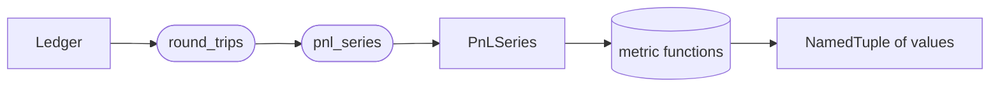

# `metrics` module

Pure functions over a canonical per-sample PnL intermediate
([`PnLSeries`](@ref)) built from a backtest's [`Ledger`](ledger.md). No
`Metric` abstract type, no registry trait, no IO -- metrics are ordinary
functions, and [`compute_metrics`](@ref) dispatches a small symbol table
of optional ones on top of a fixed always-on core set.

## Data flow


```mermaid
flowchart LR
    Ledger[Ledger] --> RT([round_trips])
    RT --> PS([pnl_series])
    PS --> Series[PnLSeries]
    Series --> Metrics[(metric functions)]
    Metrics --> NT[NamedTuple of values]
```

The ledger goes through one aggregation pass (`pnl_series(::Ledger)`,
in `ledger_series.jl`); every metric then reads from the resulting
`PnLSeries`. The pairing of opens and closes is the ledger's own
(`Match` events under a named rule), not something this module infers.
Metrics depend on the ledger, never the reverse.

## The canonical intermediate

```julia
struct PnLSeries
    timestamps::Vector{DateTime}
    pnl::Vector{Float64}
    window_end_spot::Float64     # placeholder until slice 5; NaN from the ledger
    n_opens::Int
    n_closes::Int
    n_unmarked::Int              # placeholder until slice 5; 0 from the ledger
end

pnl_series(L::Ledger; unit = :structure) -> PnLSeries
```

One sample per structure by default: the round trips of one group
closed at one instant, summed, in USD (the ledger keeps whole cents and
converts at this one boundary); `unit = :leg` gives one sample per round
trip. Timestamps are the closing instants; `n_opens` and `n_closes`
count `Open` and `Close` fills. Samples are ordered by
`(timestamp, pnl)`, losses first within an instant, so path metrics read
a deterministic, reconstructible order.

Open lots at the window end contribute nothing: the ledger neither
force-settles nor skips a lot, so `window_end_spot` is `NaN` and
`n_unmarked` is `0`. Both fields are placeholders until slice 5 replaces
the series with the structure series and the equity curve from chain-mid
marks; they stay in place so the persisted schema and `compute_metrics`
are unchanged until then.

### Derived views

```julia
equity_curve(series::PnLSeries) -> Vector{Float64}
```

`cumsum(series.pnl)`. Empty input returns an empty vector.

## Always-on metrics

Cheap, unparameterized, universally interesting. The orchestrator
computes these unconditionally on every call -- they are not listed
in an experiment's `OutputSpec`, because that is for opt-in optional
metrics with kwargs.

| Function | Returns | Empty-series behavior |
|---|---|---|
| `total_pnl(series)` | `Float64` | `0.0` |
| `n_round_trips(series)` | `Int` | `0` |
| `hit_rate(series)` | `Float64` | `NaN` |

`hit_rate` returns `NaN` (not `0.0`) on an empty series because hit
rate is genuinely undefined with no trades; `NaN` propagates honestly
through downstream math instead of silently reading as "0% wins."
`hit_rate` counts strictly positive PnL -- breakeven trades (PnL
exactly zero) are not wins.

`series.n_opens` and `series.n_closes` are exposed as struct fields,
not as separate metric functions, because they already live on
`PnLSeries` and adding `n_opens(series)` would be a one-line
forwarder that earns nothing. They appear under `:n_opens` and
`:n_closes` keys in the `compute_metrics` result.

## Optional metrics

Symbol-addressable, kwarg-carrying, opt-in. The `Experiment`
orchestrator passes its `outputs.metrics` (a `Vector{Symbol}`) straight
through to [`compute_metrics`](@ref), so the public symbol *is* the contract.

| Symbol | Function | Default kwargs | Returns | Empty-series behavior |
|---|---|---|---|---|
| `:sharpe`        | `sharpe(series; ...)`        | `(periods_per_year=252, risk_free=0.0)` | `Float64` | `NaN` (also `NaN` on zero variance or <2 trades) |
| `:sortino`       | `sortino(series; ...)`       | `(periods_per_year=252, risk_free=0.0)` | `Float64` | `NaN` (also `NaN` when no downside or zero downside deviation) |
| `:max_drawdown`  | `max_drawdown(series)`       | -- | `Float64` (peak-to-trough cash drop, always ≥ 0) | `0.0` |
| `:volatility`    | `volatility(series; ...)`    | `(periods_per_year=252,)` | `Float64` (annualized std of pnl) | `NaN` |
| `:profit_factor` | `profit_factor(series)`      | -- | `Float64` (gross wins / gross losses, or `Inf` when no losses) | `NaN` (also on all-breakevens) |

Sampling convention: each sample is one observation. Sharpe,
Sortino, and volatility annualize by multiplying by
`sqrt(periods_per_year)` under the assumption that `periods_per_year`
samples occur per year. Slice 5 moves the ratios onto the
session-to-session differences of cash equity (proposal decision 6);
until then callers whose cadence differs override the default 252 via
the kwargs path below.

## Dispatch

```julia
compute_metrics(series::PnLSeries, requested::Vector{Symbol}=Symbol[];
                kwargs::AbstractDict{Symbol,<:NamedTuple}=Dict{Symbol,NamedTuple}())
    -> NamedTuple
```

Returns a `NamedTuple` whose keys are the always-on core names first
(in fixed order: `:total_pnl`, `:n_round_trips`, `:n_opens`,
`:n_closes`, `:hit_rate`), followed by every symbol in `requested`,
in the order given.

`kwargs` is a per-metric override map. Each entry merges with the
default kwargs baked into the metric's dispatch-table entry, so a
partial override (`Dict(:sharpe => (periods_per_year=12,))`) keeps
the rest of that metric's defaults. Unknown symbols error loudly with
the list of known names.

## Key decisions

| Decision | Why |
|---|---|
| **Pure functions, no `Metric` trait** | Metrics are just functions over a `PnLSeries`. A registry / abstract `Metric` type would add ceremony without buying polymorphism we need; the symbol table gives "select-by-name" without baking it into a type hierarchy. |
| **The series is built from the ledger, by the ledger's own pairing** | The fill-vector builder FIFO-matched after the fact and guessed intent from direction, with a float residue. The ledger records intent and each `Match` under a named rule; the series reads what was recorded and infers nothing. |
| **Sample unit is the structure** | Proposal decision 6: a strangle closed at one instant is one sample, not two, so `hit_rate` and the annualised ratios count structures. `unit = :leg` remains for inspection. |
| **`PnLSeries` carries timestamps and raw counts, not just `Vector{Float64}`** | Sharpe-with-annualization wants a per-sample time index; max-drawdown wants the equity curve in time order; `n_opens` / `n_closes` are not derivable from `pnl` alone. |
| **Two placeholder fields kept until slice 5** | `window_end_spot` and `n_unmarked` no longer mean anything the ledger computes (it neither marks nor skips a lot), but removing them now would churn the persisted schema and `compute_metrics` twice. They leave with the structure series and the equity curve. |
| **Always-on vs optional split** | Always-on metrics are cheap, unparameterized, and read on every reporting line; lying about their cost by making them opt-in would force every `Experiment` to list `[:total_pnl, :hit_rate, ...]`. Optional metrics carry kwargs and dispatch by symbol so `OutputSpec.metrics` stays a flat config-friendly `Vector{Symbol}`. |
| **Symbol → function dispatch table** | Mirrors the backend-selection pattern used by Optim.jl / MLJ.jl. Each table entry is `(fn=..., defaults=(...))`, so requesting a symbol is one call with a complete contract; the per-experiment kwargs override merges on top. Unknown symbols error loudly rather than silently dropping. |
| **Canonical sample order: timestamp, then pnl ascending** | Samples that close at the same instant have no natural order, yet `max_drawdown` reads the equity curve sample by sample. Losses-first within a timestamp is deterministic, reconstructible from the persisted series, and conservative for drawdown. |
| **Default kwargs baked into the dispatch entry** | The symbol carries the contract; default-arg drift between two call sites is impossible because there is only one source of truth. Per-experiment overrides come in through `compute_metrics(..., kwargs=...)`. |

## Responsibility boundaries

**Owns:** `PnLSeries`, the `pnl_series(::Ledger)` adapter, derived
read-only views like `equity_curve`, the always-on core metric
functions (`total_pnl`, `n_round_trips`, `hit_rate`), the optional
symbol-addressable metric set (`sharpe`, `sortino`, `max_drawdown`,
`volatility`, `profit_factor`), and the `compute_metrics` dispatch
entry point.

**Does NOT own:**

- Ledger construction, lot pairing, cash rules and round trips. That is
  the [`ledger`](ledger.md), fed by the [backtest engine](backtest.md).
- Settlement and marks. Lifecycle belongs to the backtest engine; the
  equity curve from marks is slice 5.
- Persistence, plotting, reporting. Downstream layers.

## Failure modes

| Condition | Behavior |
|---|---|
| Empty ledger | `pnl_series` returns an empty `PnLSeries`; `equity_curve` returns empty. |
| Open lots at the window end | Contribute no sample; `n_opens` counts them, `total_pnl` does not. |
| Several samples close at one timestamp | Ordered by pnl ascending within the timestamp (losses first); ledger order does not matter. |
| `pnl_series` called with an unknown `unit` | `ArgumentError` naming the two units. |
| `compute_metrics` called with an unknown symbol | Errors loudly with the offending symbol and the list of known names. |
| Sharpe / Sortino / volatility on `<2` samples or zero variance | Returns `NaN`. |
| Profit factor on all-breakeven or empty series | Returns `NaN`. Wins with zero losses returns `Inf`. |

## Future work

- Slice 5: the structure series and the equity curve from chain-mid
  marks on the session grid; ratios on the session-to-session
  differences of cash equity, annualised by sessions per year; drawdown
  on equity levels; `window_end_spot` and `n_unmarked` leave
  `PnLSeries`, the manifest and `show`.
- Per-contract metric views (Sharpe / win-rate broken out by
  underlying or expiry bucket).
- Promoting per-metric kwargs into `Experiment` itself once at least one
  workflow needs the overrides to survive into provenance.
- A `Metric` trait if user-defined metrics ever need to register
  themselves into the dispatch table from outside the module.

## Layout

```
src/metrics/
    pnl_series.jl     # PnLSeries struct + equity_curve
    ledger_series.jl  # pnl_series(::Ledger), the adapter from the ledger
    core.jl           # total_pnl + n_round_trips + hit_rate
    optional.jl       # sharpe, sortino, max_drawdown, volatility, profit_factor
    dispatch.jl       # _METRIC_TABLE + compute_metrics

test/metrics/
    test_pnl_series.jl
    test_ledger_series.jl
    test_core.jl
    test_optional.jl
    test_dispatch.jl
```

All files are `include`d into the top-level `VolSurfaceAnalysis`
module; no submodule wrappers.
