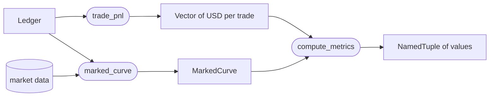

# `metrics` module

Pure functions over **two** honest inputs: a [`MarkedCurve`](#the-marked-curve)
for questions about time, and a plain vector of per-trade dollars for
questions about trades. No `Metric` abstract type, no registry trait --
metrics are ordinary functions, and [`compute_metrics`](@ref) dispatches a
small symbol table of optional ones on top of a fixed always-on core set.

## Two units, because there are two questions

A metric's answer is only as honest as its sample unit.

- **Trade questions** -- total realised profit, hit rate, profit factor,
  how many round trips, opens and closes -- have a trade as their unit.
  They read `trade_pnl(::Ledger)`, one dollar figure per closed structure.
- **Path questions** -- Sharpe, Sortino, volatility, maximum drawdown --
  have a *period of time* as their unit. They read the marked curve, whose
  points are session closes, and annualise by sessions per year.

Before this round every metric read a series of closed trades, so Sharpe
multiplied by the square root of 252 while its observations were trades,
not days: a strategy closing about 252 structures a year looked plausible
by accident and a weekly strategy was overstated by roughly a factor of
two. Holding the same trades overnight or for a month produced the same
ratio. `max_drawdown` had the same defect in another form -- a curve of
closed trades is flat while a position is open, so a book could move
deeply against itself and recover with no drawdown recorded at all.

## Data flow


```mermaid
flowchart LR
    Ledger[Ledger] --> TP([trade_pnl])
    TP --> Trades[Vector of USD per trade]
    Ledger --> MC([marked_curve])
    Data[(market data)] --> MC
    MC --> Curve[MarkedCurve]
    Trades --> CM([compute_metrics])
    Curve --> CM
    CM --> NT[NamedTuple of values]
```

Only the curve needs market data, and only where the book is not flat.
Everything else is a function of the ledger. Metrics depend on the ledger,
never the reverse.

## The marked curve

```julia
struct MarkedCurve
    timestamps      :: Vector{DateTime}   # session closes that were marked
    profit          :: Vector{Float64}    # marked profit in USD at each
    unmarked_at     :: Vector{DateTime}   # session closes that could not be
    unmarked_reason :: Vector{Symbol}     # why, one per entry
end

marked_curve(L::Ledger, data, u::Underlying, from, to) -> MarkedCurve
```

Two pairs of parallel vectors, and a session is in exactly one of them.
Derived views: `n_marked`, `n_unmarked`, `session_changes`.

### The accounting identity

At any instant,

> marked profit = realised profit + unallocated fees + unrealised profit

The ledger alone supplies the first two terms; only the third needs market
data, and it is zero whenever the book is flat. The builder uses the
equivalent form that falls out of the cash rules:

> marked profit = ledger cash + the open book marked to market

because cash already carries the cost basis of every open lot with the
opposite sign. This is why **cash alone is not the curve**: selling a
strangle credits premium at open, and sampling cash would report that
receipt as profit and materially overstate a short book.

Profit is measured from zero. The codebase has no deposited account and no
net asset value, and none is invented here.

### The grid

The close of each trading session in the evaluation window, derived rather
than configured -- there is no `mark_grid` setting. It comes from
`session_closes` in the [backtest](backtest.md) module, the same session
machinery `:session_close` settles against: a calendar-open date is a
session when the underlying printed in the 09:30-16:00 ET window, and its
close is the last of those prints. Early closes and unscheduled closures
therefore need no table, under the same regular-session `SpotPrice`
requirement stated in [market_data](market_data.md) -- and the grid reads
exactly those windows, one at a time, so it is exposed to the tree only
where that requirement is claimed.

A session counts only when its **whole** window lies inside the evaluation
bounds. A session the bounds clip is not a short session but one this run
did not see end to end, and every observation must span a whole one for
annualising by sessions to mean anything. That absence is temporal: the
session is outside the window, not unanswerable inside it.

### Marking one lot

`mark_price(cut, contract, t)` is the contract's own quote mid
`(bid + ask) / 2`, with the surface price as fallback, and
`UnpriceableLeg(:no_mark)` after that. The mid rather than the last trade:
a trade may be hours stale at a quiet strike, while a two-sided quote is a
price someone stands behind at `t`. A one-sided quote is not a mid and
falls through to the surface exactly as an absent one does.

Marking runs inside `run_experiment`, while the cut is open, and reads
through a `TimeCut` at each point, so no-lookahead is structural here as in
the tick loop. It is intentionally *not* a pure function of the ledger.

### What an unmarkable point does

**One lot without an honest price makes the whole session unanswerable, so
the point leaves the curve, is named and counted, and
`session_changes` refuses to span it.** No partial sum, no carried-forward
value, no `NaN`, and the curve is not truncated (design rule 7). Three
consequences worth stating plainly:

- The session appears in `unmarked_at` / `unmarked_reason` and nowhere
  else. `n_unmarked` is how many.
- **The builder still examines the rest of the session's lots**, and
  retains a `RunFailure` for each one it cannot price. The running total
  is discarded: carrying on is for the account of what went unanswered,
  never for a partial portfolio value. So a broken session is one curve
  entry and as many failure records as it had failed lots, and the two
  agree instant for instant. A printless session names its underlying
  instead of a lot. `marked_curve` returns both, and the run carries them
  (see [experiment](experiment.md)); only `UnpriceableLeg` is caught, so
  an unexpected error still propagates rather than becoming an empty
  output under a successful-looking run.
- A break costs **two** observations, not one: neither the step into the
  broken session nor the step out of it is a period this run observed. A
  step spanning it would cover two periods while being scaled as one.
- `max_drawdown` still walks the marked levels across a break, because
  profit is measured from zero rather than reset per segment. Its answer
  over a curve with unmarked sessions is a lower bound on the true depth,
  and `n_unmarked` says how much it could not see.

**When to revisit this.** Breaking is right for a backtest, which has no
obligation to publish a number; it is not what an accounting system does.
A fund descends a fair-value hierarchy (quoted price, then observable
model inputs, then judgment) precisely because it must report daily, and
listed options have a published end-of-day settlement price for every
series so the question rarely arises at all. The trigger for rethinking
is therefore volume, not principle: while `n_unmarked` stays near zero
the choice costs nothing, and if a run starts losing many series the
answer is to collect official per-series marks rather than to start
inventing values. Accepted on those terms 2026-09-14.

Reasons: `:no_mark` (neither a quote mid nor a surface price for some open
lot) and `:unexpected_gap` (a calendar-open date whose window holds no
print, stamped at that session's nominal 16:00 ET close -- a label on a
failure, never a value). `marked_curve` warns once with the count, the same
way `settlements` reports an unpriceable lot: the boundary that finds a gap
is the boundary that reports it.

### Capital

Capital is fixed at 1, and that is exact rather than an approximation. At a
zero risk-free rate a constant capital base scales both the mean and the
standard deviation of the period profits equally, so it cancels from every
ratio here: Sharpe on dollar changes is Sharpe on returns for capital 1,
100,000 or any other positive constant. It is therefore **not an argument**
-- a kwarg that cannot change a result would only be a contract to
maintain. `test_optional.jl` pins the cancellation by scaling a curve
instead.

Capital becomes meaningful only when the risk-free hurdle is non-zero, the
base compounds, or results are printed as percentages. The risk-free rate
itself belongs to market data (`RateCurve`), not to a metric parameter, and
is zero in this round.

## Trade-level input

```julia
trade_pnl(L::Ledger; unit = :structure) -> Vector{Float64}
```

One entry per `(group, closed_at)` by default -- a strangle closed at one
instant is one trade -- summed in whole cents and converted once;
`unit = :leg` gives one entry per round trip. The pairing is the ledger's
own (`Match` events under a named rule), never inferred here. Entries are
ordered by `(closed_at, pnl)`, losses first within an instant, so a run's
trade vector is deterministic and reconstructible.

## The cents boundary

`cents_to_usd(cents::Integer) -> Float64` is the one place the ledger's
whole USD cents become floating-point dollars, as explicitly as
`contract_cents` names the rounding boundary in the other direction. Every
dollar figure this module reports crosses there.

Marks do not cross it: a quote mid or a surface price is floating point at
source and is never whole cents (the mid of 1.05/1.06 is 1.055), so the
unrealised term of a marked profit is float arithmetic from the start. The
realised term stays integer until the boundary.

## Always-on metrics

Cheap, unparameterized, universally interesting. The orchestrator computes
these unconditionally on every call -- they are not listed in an
experiment's `OutputSpec`, because that is for opt-in optional metrics with
kwargs.

| Function | Input | Returns | Empty-input behavior |
|---|---|---|---|
| `total_pnl(trades)` | trades | `Float64` | `0.0` |
| `n_round_trips(trades)` | trades | `Int` | `0` |
| `n_opens(L)` | ledger | `Int` | `0` |
| `n_closes(L)` | ledger | `Int` | `0` |
| `hit_rate(trades)` | trades | `Float64` | `NaN` |

`total_pnl` is deliberately the **realised** total and not the curve's last
level: the two differ by the unrealised profit of whatever is still open,
and quietly widening the meaning of a reported figure is how a comparison
between two runs stops being one.

`hit_rate` returns `NaN` (not `0.0`) with no trades because hit rate is
genuinely undefined then; `NaN` propagates honestly through downstream math
instead of silently reading as "0% wins". It counts strictly positive PnL,
so breakeven trades are not wins.

`n_opens` and `n_closes` are plain functions of the ledger. That is the
home they have now that the series wrapper which carried them as fields is
gone; an expiry is not a closing fill, so a book that expired rather than
traded out reports opens with no closes.

## Optional metrics

Symbol-addressable, kwarg-carrying, opt-in. The `Experiment` orchestrator
passes its `outputs.metrics` (a `Vector{Symbol}`) straight through to
[`compute_metrics`](@ref), so the public symbol *is* the contract.

Every optional metric has the same signature, `f(trades, curve; kwargs...)`,
and reads whichever argument is its sample unit. The *Samples* column below
says which that is; it is a fact about the function, stated in its
docstring and pinned by its tests, not a field of the dispatch table.

| Symbol | Samples | Default kwargs | Returns | Empty-input behavior |
|---|---|---|---|---|
| `:sharpe`        | sessions | `(periods_per_year=252, risk_free=0.0)` | `Float64` | `NaN` (also on zero variance or <2 session changes) |
| `:sortino`       | sessions | `(periods_per_year=252, risk_free=0.0)` | `Float64` | `NaN` (also when no downside or zero downside deviation) |
| `:max_drawdown`  | sessions | -- | `Float64` (peak-to-trough drop in marked profit, always >= 0) | `0.0` |
| `:volatility`    | sessions | `(periods_per_year=252,)` | `Float64` (annualized std of session changes) | `NaN` |
| `:profit_factor` | trades   | -- | `Float64` (gross wins / gross losses, or `Inf` when no losses) | `NaN` (also on all-breakevens) |

Sampling convention: one observation per pair of **adjacent marked**
session closes. `periods_per_year` is therefore the number of trading
sessions in a year, which is what annualising by the square root of 252 has
always claimed to mean.

## Dispatch

```julia
compute_metrics(L::Ledger, curve::Union{MarkedCurve,Nothing},
                requested::Vector{Symbol}=Symbol[];
                kwargs::AbstractDict{Symbol,<:NamedTuple}=Dict{Symbol,NamedTuple}())
    -> NamedTuple
```

Returns a `NamedTuple` whose keys are the always-on core names first (in
fixed order: `:total_pnl`, `:n_round_trips`, `:n_opens`, `:n_closes`,
`:hit_rate`), followed by every symbol in `requested`, in the order given.

**The two inputs.** The ledger is the authority for the trade side:
`trade_pnl(L)` is derived once inside, and the two fill counts are read
straight off it. The curve is passed in because it is the one result that
is *not* a function of the ledger -- whoever has the market data open
builds it.

Each dispatch-table entry is `(fn=..., defaults=(...))`. The dispatcher
hands both inputs to every entry, so the table records no per-metric
input and adding a metric is one row and one function. The cost is an
ignored argument in each body, and one consequence worth knowing: the
dispatcher cannot tell a session metric from a trade metric, so when
there is no curve it omits the **whole** optional set rather than part
of it. `:profit_factor` needs no curve and is dropped with the rest.

`kwargs` is a per-metric override map. Each entry merges with the default
kwargs baked into the metric's dispatch-table entry, so a partial override
(`Dict(:sharpe => (periods_per_year=12,))`) keeps the rest of that metric's
defaults. Unknown symbols error loudly with the list of known names.

**`curve === nothing`** is that dependence made visible: the always-on core
is computed as always, and **every** optional metric is omitted from the
result rather than reported as `NaN`. An absent key says "not computed";
`NaN` would say "computed, and undefined", a different and false claim. The
omission is wholesale rather than selective because every metric takes both
inputs, so the table does not record which one each reads: `:profit_factor`
goes with the others though it needs no curve. It is a run-time path: a
run whose market data cannot be opened has no curve. `load_run` does not
take it, because loading reads the metrics the run reported and computes
none.

## Key decisions

| Decision | Why |
|---|---|
| **Two inputs, not one series** | A metric's sample unit is the whole of its honesty. Trades and sessions are different units answering different questions, and one intermediate serving both is what let Sharpe annualise trade counts as though they were days. |
| **Pure functions, no `Metric` trait** | Metrics are just functions. A registry / abstract `Metric` type would add ceremony without buying polymorphism we need; the symbol table gives "select-by-name" without a type hierarchy. |
| **Uniform arity: every metric takes both inputs** | Adding a metric is one table row and one function, with no second place to keep in sync. The price is an ignored argument per body and a wholesale rather than selective omission when there is no curve; the sample unit lives in the docstring and the tests instead of in a column. |
| **Marked profit from zero, capital fixed at 1** | There is no deposited account or NAV to divide by, and at a zero rate the base cancels from every ratio. Inventing a denominator would be a number with no source; a powerless config value would be a contract to maintain. |
| **Cash is not the curve** | Premium received on a short option is a receipt against a liability. A curve sampling cash would book the opening credit as profit. |
| **The grid is derived from sessions, not configured** | Daily observations are what annualisation by trading sessions means. A configurable grid would let a run pick a cadence its scaling constant does not match. |
| **A quote mid, surface as fallback, then a named failure** | A last trade may be stale for hours at a quiet strike. Two named sources and then an error is design rule 7 applied to a leg that cannot honestly be priced. |
| **An unmarkable point breaks the curve rather than carrying or truncating** | Carrying the previous mark invents a value the data does not have; truncating discards honest points after the first gap. Breaking loses exactly the observations that were unanswerable, and the count says how many. |
| **`trade_pnl` returns a plain `Vector{Float64}`** | Structure-level grouping is preserved as a *function*, not as a struct with scalars attached: nothing that reads it needs more than the numbers. |
| **`n_opens` / `n_closes` are ledger functions** | They are counts of the ledger's own events, so the ledger is their natural argument -- and it is a home that does not depend on a wrapper type existing. |
| **`total_pnl` stays realised** | Changing what a reported number means, while keeping its name, breaks every comparison with a previously stored run. |
| **Absent key, not `NaN`, for an uncomputable metric** | `NaN` is the answer to "computed, and undefined" (one trade, zero variance). "Could not compute at all" is a different fact and must not read the same. |
| **Default kwargs baked into the dispatch entry** | The symbol carries the contract; default-arg drift between two call sites is impossible because there is only one source of truth. |
| **Canonical trade order: `(closed_at, pnl)` ascending** | Trades closing at one instant have no natural order; losses-first is deterministic and reconstructible. |

## Conventions consulted

Per design rule 5, the sources checked before fixing this round's new
public API shapes (checked 2026-09-14).

| Decision | Source checked | What it says |
|---|---|---|
| `MarkedCurve` as a plain `struct` of `Vector` fields, with no supertype and no type parameters | [Julia manual, Style Guide](https://docs.julialang.org/en/v1/manual/style-guide/) | "Don't use unnecessary static parameters" -- a parameter not used in the body should not exist -- and "avoid elaborate container types". The fields here are always `Vector{DateTime}` / `Vector{Float64}` / `Vector{Symbol}`, so there is no variation to abstract over. |
| Same, on whether a supertype is needed to participate in ecosystem interfaces | [Tables.jl, implementing the interface](https://tables.juliadata.org/stable/implementing-the-interface/) | Interface objects "are not required to subtype, but only implement the required interface methods"; its abstract types are explicitly not for dispatch. TimeSeries.jl's parametric `TimeArray <: AbstractTimeSeries` is the counter-case, and it is a *generic container library* where element and array types genuinely vary. |
| Same, on field type concreteness | [BlueStyle, "Type annotation"](https://github.com/JuliaDiff/BlueStyle) | Use the concrete field type rather than an abstract one; optimise with parametric types later rather than designing for variation that has not appeared. |
| `cents_to_usd` as one explicitly named conversion at the integer/float boundary | [Julia `Dates`, `Dates.value`](https://docs.julialang.org/en/v1/stdlib/Dates/) and [FixedPointDecimals.jl](https://github.com/JuliaMath/FixedPointDecimals.jl) | The ecosystem precedent is a named accessor, never an implicit promotion: `Dates.value(Millisecond(10))` is the only way to the raw integer, and FixedPointDecimals keeps money on an integer representation precisely so "$0.30 is actually 30 cents", making the crossing explicit and checked. |
| Keeping `_METRIC_TABLE` entries as plain named tuples of `(fn, defaults)`, selected by symbol | [MLJ.jl model search](https://juliaai.github.io/MLJ.jl/stable/model_search/) | MLJ's registry entries are literally named tuples of metadata, selected by name, and they already carry exactly this kind of field: `input_scitype`, `target_scitype`, `fit_data_scitype` record *what data the algorithm consumes* alongside its constructor and defaults. Metadata named tuples selected by name are the established shape; this table stays at the minimal end of it, carrying only the callable and its defaults. |
| Same, on when to graduate away from a symbol table | [Optim.jl minimization](https://julianlsolvers.github.io/Optim.jl/stable/user/minimization/) and [StatsBase `pacf`](https://github.com/JuliaStats/StatsBase.jl/blob/master/src/signalcorr.jl) | Optim selects algorithms by singleton *instances* (`LBFGS()`), which is what a table graduates to once each algorithm needs its own dispatch-driven behaviour; StatsBase's `method::Symbol=:regression` is the low-ceremony end. Five parameterless reductions sit at the StatsBase end. |
| `Union{MarkedCurve,Nothing}` for "this derived result could not be computed" | [Julia manual FAQ, nothingness](https://docs.julialang.org/en/v1/manual/faq/) and [Missing Values](https://docs.julialang.org/en/v1/manual/missing/) | `nothing` is "the absence of a meaningful return value", and `Union{T,Nothing}` is named as the recommended type "when a value `x` of type `T` exists only sometimes". `missing` is reserved for the statistical sense -- "no value is available for a variable in an observation, but a valid value theoretically exists". A curve that could not be built is absence of a thing, not an unobserved observation; an empty curve would be worse than both, conflating "not computed" with "computed, came out empty". |

## Responsibility boundaries

**Owns:** `MarkedCurve` and its derived views, the `marked_curve` builder
and `mark_price`, `trade_pnl`, the `cents_to_usd` boundary, the always-on
core metric functions (`total_pnl`, `n_round_trips`, `hit_rate`, `n_opens`,
`n_closes`), the optional symbol-addressable metric set (`sharpe`,
`sortino`, `max_drawdown`, `volatility`, `profit_factor`), and the
`compute_metrics` dispatch entry point.

**Does NOT own:**

- Ledger construction, lot pairing, cash rules and round trips. That is
  the [`ledger`](ledger.md), fed by the [backtest engine](backtest.md).
- Settlement, and the session machinery the grid is built from. Lifecycle
  and `session_closes` belong to the [backtest](backtest.md) module; this
  module consumes the grid.
- Opening market data. `marked_curve` takes an already-open reader map;
  the [experiment](experiment.md) orchestrator and `load_run` own the
  lifetime.
- Persistence, plotting, reporting. Downstream layers.

## Failure modes

| Condition | Behavior |
|---|---|
| Empty ledger | `trade_pnl` is empty; `marked_curve` is a flat zero curve over the window's sessions. |
| Window covering no whole session | The curve has no points and no unmarked entries: temporal absence. |
| An open lot with no quote mid and no surface price | `mark_price` throws `UnpriceableLeg(:no_mark)`; `marked_curve` records the session in `unmarked_at` and warns with the count. |
| A calendar-open date with no prints in its window | The session is `:unexpected_gap` in `unmarked_at`, stamped at the nominal 16:00 ET close. |
| Two marked sessions with an unmarked one between them | `session_changes` yields no observation for that pair. |
| `MarkedCurve` built from mismatched or unsorted vectors | `ArgumentError` naming which pair disagrees; nothing is constructed. |
| `trade_pnl` called with an unknown `unit` | `ArgumentError` naming the two units. |
| `compute_metrics` called with an unknown symbol | Errors loudly with the offending symbol and the list of known names. |
| `compute_metrics` with `curve === nothing` | **Every** optional metric is omitted, `:profit_factor` included though it needs no curve: each metric takes both inputs, so the table cannot say which ones to keep. The always-on core is unaffected. |
| Sharpe / Sortino on `<2` session changes or zero variance | Returns `NaN`. |
| Volatility on `<2` session changes | Returns `NaN`; on zero variance it returns `0.0`, which is the true dispersion, not an unanswerable question. |
| Sortino on constant *negative* changes | Defined, not `NaN`: the mean is negative and the downside deviation is non-zero. `NaN` is for no downside at all. |
| Profit factor on all-breakeven or empty trades | Returns `NaN`. Wins with zero losses returns `Inf`. |

## Future work

- A non-zero risk-free rate, which must choose the short-end tenor for the
  per-session hurdle and retain the intentional coupling to the curve
  `SurfaceFrom` uses.
- Capital / NAV reporting, once a policy sizes from equity or results are
  printed as percentages.
- Aggregating simultaneous samples for path metrics over a finer grid than
  one session.
- Per-contract metric views (Sharpe / win-rate broken out by underlying or
  expiry bucket).
- Promoting per-metric kwargs into `Experiment` itself once at least one
  workflow needs the overrides to survive into provenance.

## Layout

```
src/metrics/
    curve.jl      # MarkedCurve, cents_to_usd, n_marked / n_unmarked, session_changes
    marks.jl      # mark_price + marked_curve, the module's one market-data read
    trades.jl     # trade_pnl(::Ledger), the per-trade dollar vector
    core.jl       # total_pnl, n_round_trips, hit_rate, n_opens, n_closes
    optional.jl   # sharpe, sortino, max_drawdown, volatility, profit_factor
    dispatch.jl   # _METRIC_TABLE + compute_metrics

test/metrics/
    test_curve.jl
    test_marks.jl
    test_trades.jl
    test_core.jl
    test_optional.jl
    test_dispatch.jl
```

All files are `include`d into the top-level `VolSurfaceAnalysis`
module; no submodule wrappers.
