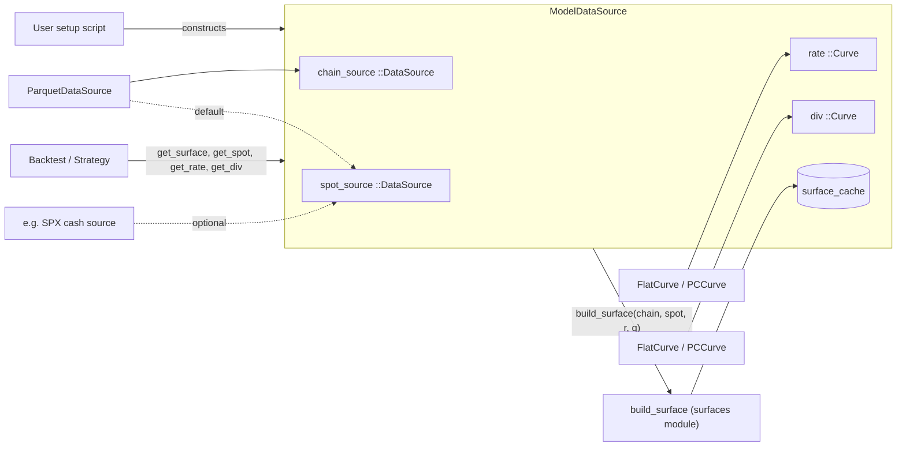

# `model_data` module

The model-facing data layer. Sits between the raw `data` module
(vendor chains and spots) and downstream surface / backtest / strategy
code. Its job is to give the engine everything it needs at a
timestamp -- a vol surface, a spot, a rate, a dividend yield -- and
hide where each piece came from.

## Three layers, strictly separated

The module enforces a one-way flow that mirrors how a user thinks
about setup:

1. **Model needs** -- what the engine consumes: a surface, a spot,
   a rate, a div.
2. **Builders** -- pure functions that turn raw data into model
   objects. `build_surface(chain, spot, r, q) :: VolatilitySurface`
   is the canonical example. Today the rate and div curves are
   built trivially as `FlatCurve` / `PCCurve` literals; a future
   `build_rate_curve(treasury_source, ...)` would slot in here.
3. **Raw data getters** -- `DataSource`s and their `get_X(ds, ts)`
   methods (`data` module). Pure I/O.

Builders are the only place raw data and model objects meet.
`Curve` knows no I/O; `DataSource` knows no math; `ModelDataSource`
composes the three without conflating them.

## Model objects

### `Curve`

```julia
abstract type Curve end
(c::Curve)(ts::DateTime) = error("not implemented")
```

A `Curve` is a math object -- a function in time. Callable;
returns `Float64`. Math operations (parallel shifts, bumps for
greeks, forwards between two dates) will live on `Curve` as they
appear; not in this initial slice.

Concrete subtypes today (`src/model_data/curves.jl`):

- `FlatCurve(value)` -- constant. `(c)(ts) = c.value`.
- `PCCurve(knots, values)` -- piecewise constant. Lookup via
  `searchsortedlast`. Out of range: flat-extrapolate (first value
  before earliest knot, last value after latest knot). Constructor
  enforces sorted, non-empty, equal-length, unique knots.

### `VolatilitySurface` (lives in `surfaces` module)

Referenced here as the return type of `build_surface`. See
`docs/modules/surfaces.md` for its API.

## Builders

`build_surface(chain::Vector{OptionQuote}, spot::Float64, rate::Float64,
div::Float64) :: VolatilitySurface` (defined in `surfaces` module).

Kept as a free function rather than an outer constructor on
`RawSurface`: it does non-trivial work (IV inversion, OTM-side
picking, slicing), it returns an abstract type, and it is the
natural dispatch point for the future `QuoteConvention` trait.

Today there is only one path -- the mark-price convention that
`ParquetDataSource` produces. Pre-computed-IV vendors and bid/ask
vendors will be added later as new methods dispatched on a
`QuoteConvention` trait declared on the chain source.

## Composition: `ModelDataSource`

```julia
struct ModelDataSource
    chain_source  :: DataSource
    spot_source   :: DataSource
    rate          :: Curve
    div           :: Curve
    surface_cache :: Dict{DateTime, Union{VolatilitySurface, Nothing}}
end

ModelDataSource(
    chain_source::DataSource;
    rate::Curve,
    div::Curve,
    spot_source::DataSource = chain_source,
)
```

Default constructor pulls spot from the same source as chains, the
common case. Supplying a separate `spot_source` handles the
SPX-via-SPY case and any other split-vendor setup.

### Methods

- `available_timestamps(mds, from, to) :: Vector{DateTime}` --
  delegates to `chain_source`. Surfaces only exist where chains do.
- `get_chain(mds, ts)` -- passthrough to `chain_source`.
- `get_spot(mds, ts)` -- passthrough to `spot_source`.
- `get_rate(mds, ts) :: Float64` -- `mds.rate(ts)`.
- `get_div(mds, ts)  :: Float64` -- `mds.div(ts)`.
- `get_surface(mds, ts) :: Union{VolatilitySurface, Nothing}` --
  builds on demand, caches result (including `nothing`).
- `clear_cache!(mds)` -- empties surface cache and forwards to
  the chain source.

Pseudocode for `get_surface`:

```julia
function get_surface(mds, ts)
    haskey(mds.surface_cache, ts) && return mds.surface_cache[ts]
    chain = get_chain(mds.chain_source, ts)
    spot  = get_spot(mds.spot_source, ts)
    surf = (chain === nothing || ismissing(spot)) ? nothing :
           build_surface(chain, spot, mds.rate(ts), mds.div(ts))
    mds.surface_cache[ts] = surf
end
```

## Data flow



## Responsibility boundaries

**Owns:** the composition struct, the surface cache, the
`Curve` types (`FlatCurve`, `PCCurve`), the model-facing accessor
methods.

**Does NOT own:**

- Vendor parsing, lazy reads, day-level chain/spot caches -- that
  is `data`.
- The surface representation, IV inversion, BS pricing -- that is
  `surfaces`.
- Schedule / timeline ownership -- callers ask for the timestamps
  they want.
- Strategy logic -- downstream.
- Concurrency -- single-threaded; surface cache is a plain `Dict`.

## Key decisions

| Decision | Why |
|---|---|
| **Strict three-layer separation: raw I/O, builders, model objects** | The user-facing mental model reads top-down ("I need a surface, therefore I need a chain and rate and div, therefore I pick these sources"). The code reflects that: nothing mixes layers. A `Curve` never reads from disk; a `DataSource` never does math; the wrapper composes both via explicit builder calls. |
| **`Curve` is a math abstraction, not an I/O one** | Curves are first-class objects in math finance with future math operations (shifts, bumps, forwards). Folding them under `DataSource` (as "things that respond to `get_rate`") would erase that and block growth. |
| **Spot stays as a `DataSource`, not a `Curve`** | Nothing math-y operates on spot history in v1. The natural model is the raw value at `ts`. If/when a "spot curve" math object becomes useful (integrated variance, between-tick interpolation), it joins as a separate model object built from spot data -- same pattern as rates. |
| **`build_surface` is a free function, not an outer constructor** | Non-trivial work, returns an abstract type, will dispatch on a future `QuoteConvention` trait. Concrete surface subtypes still expose plain outer constructors. |
| **Single `build_surface` method today** | One vendor (Polygon mark-price chains). The seam for multiple methods is a `QuoteConvention` trait on the chain source. Future work; not v1. |
| **Surface cache keyed by `ts`, stores `Union{Surface,Nothing}`** | Backtests revisit the same timestamps; rebuilding wastes work. Caching `nothing` prevents retrying timestamps where the chain or spot was missing. Unbounded today; LRU added if memory bites. |
| **`PCCurve` flat-extrapolates out of range** | Rate/div curves often extend slightly past their data range during a backtest. `searchsortedlast` semantics make this the natural default. If a backtest needs to detect "outside the curve" loudly, that is a validation step at experiment-config time, not a `Curve` responsibility. |
| **No `Curve` adapter over `DataSource`** | The earlier `DataSourceSpot` idea conflated the two layers. Today spot is a `DataSource` field; if a math object over spot is later needed, it is built explicitly via a builder, the same way `build_surface` builds a surface. |
| **No formal `RateSource` / `DivSource` abstract types yet** | Today rate/div are tiny curves built directly. When a vendor with caching/laziness appears, it becomes a `DataSource` with `get_rate` / `get_div`; the builder takes that source as input and returns a `Curve`. No interface change here. |
| **Provenance is not on model objects** | Reproducibility lives at the experiment-config layer (the loader call is captured there). Curves and surfaces stay clean math objects. |

## Layout

Per Julia community conventions (no submodules unless required):

```
src/model_data/
    curves.jl     # Curve, FlatCurve, PCCurve
    source.jl     # ModelDataSource + accessors

test/model_data/
    test_curves.jl
    test_source.jl
```

All files are `include`d into the top-level `VolSurfaceAnalysis`
module. No `module Curves` / `module ModelData` wrappers.

## Failure modes

| Condition | `get_surface` | `get_spot` | `get_rate` / `get_div` |
|---|---|---|---|
| Chain absent at `ts` | `nothing` (cached) | unaffected | unaffected |
| Spot missing at `ts` | `nothing` (cached) | `missing` | unaffected |
| `ts` outside `PCCurve` range | flat-extrapolated value used | unaffected | flat-extrapolated value |

## Future work

- **`QuoteConvention` trait on chain sources.** When a second vendor
  ships pre-computed `mark_iv` or only bid/ask, `build_surface`
  becomes `build_surface(quote_convention(chain_source), chain, ...)`
  and dispatches. Today's single method is the `MarkPriceQuotes` case.
- **Real rate / div data sources.** A `TreasuryDataSource <:
  DataSource` with `get_rate(ts)` plus a `build_rate_curve(...)`
  builder that returns a `Curve`. `ModelDataSource` is unaffected.
- **Curve math operations.** Parallel shifts, bumping for greeks,
  forward-rate computation, term-structure interpolation -- methods
  on `Curve` as use cases arrive.
- **Cache eviction.** Surface cache is unbounded. Mirror the `data`
  module's LRU pattern if long sweeps hit memory pressure.
- **Spot model object.** If between-tick interpolation or integrated
  variance becomes useful, introduce a spot `Curve` built via a
  dedicated builder from a spot `DataSource`.
