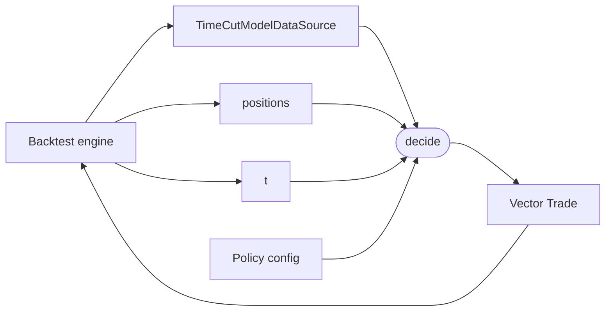

# `policies` module

Policy abstraction: a pure decision function the backtest engine
calls once per tick (after the [`Agent`](agents.md) hands one over).
A policy holds its immutable configuration (schedules, parameters,
fitted models) and implements [`decide`](@ref) to emit *trade
deltas* -- new orders the engine should fill. Closes are emitted as
counter-trades (opposite direction, same contract), so the policy
never mutates state and the engine never asks "keep or close this
position?".

Anything that changes between ticks -- refit cadence, parameter
learning, policy swaps over time -- belongs to the [`agents`](agents.md)
layer. A Policy itself is frozen for the duration of the tick on
which it was handed out.

## Data flow



The engine builds the time-cut data view, asks the agent for the
current policy, then hands `(t, cut, positions)` to `decide` to
produce the orders for this tick.

## The abstraction

```julia
abstract type Policy end

decide(p::Policy, t::DateTime, data::TimeCutModelDataSource,
       positions::AbstractVector{Position}) -> Vector{Trade}
```

One method, four arguments, one return value. Concrete policies
subtype `Policy` and implement `decide`. The empty return
`Trade[]` is the "do nothing this tick" case and must be cheap --
sparse policies (e.g. "trade once a day at 13:00") rely on it
firing tens of thousands of times.

### `NoOpPolicy`

```julia
struct NoOpPolicy <: Policy end
decide(::NoOpPolicy, _, _, _) = Trade[]
```

The trivial policy. Useful as a smoke test for the engine and as
a base case in property tests.

## Key decisions

| Decision | Why |
|---|---|
| **Policy returns trade deltas, not a portfolio** | A policy's natural output is "orders to fire," not "the portfolio I want after this tick." Deltas keep the policy small (no need to redeclare unchanged positions), make the no-op case trivially `Trade[]`, and let the engine own the open-vs-close translation in one place. |
| **Closes are counter-trades** | Rather than a separate `Close` action type or a mutable `Position`, a close is a regular `Trade` with opposite direction on the same contract. The ledger ends up holding both sides; net-open is a view (`sum(direction * quantity)` per contract). Keeps `Position` immutable and the engine path uniform: every order goes through `open_position`. A dedicated `closed::Vector{...}` register is a later convenience, not a primitive. |
| **Stateless `decide`** | The policy struct holds only configuration. Any "state" the recurrence might want (rolling windows, last-action time, fitted predictions) is either derivable from `(t, data, positions)` plus config, or it belongs to an [`Agent`](agents.md) that hands out a fresh Policy when state advances. Stateless `decide` is easier to test (no setup), easier to replay deterministically, and avoids confusion about whether to mutate or rebuild between ticks. |
| **No-lookahead is a type, not a convention** | `decide` accepts a [`TimeCutModelDataSource`](backtest.md), not a raw `ModelDataSource`. Through the supported accessor interface, queries strictly after `t` return `nothing` / `missing`. Master enforced the same property via `HistoricalView` passed at runtime; the rebuild moves it into the function signature so accidental bypass is much harder. |
| **`t` is an explicit argument** | Even though `data` is cut at `t`, schedule-driven policies that want to ask "is this my entry time?" shouldn't have to dig through `available_timestamps(data, ...)` for it. Making `t` explicit also gives the engine a trivially-cheap crosscheck against the cutoff. |
| **No engine-side schedule protocol** | Master had `entry_schedule(strategy)::Vector{DateTime}` driving the engine loop. The rebuild drops that: the engine walks every available timestamp and the policy gates inside `decide`. A scheduled policy's `decide` becomes a hash-lookup; the cost on minute-data over a year is ~7ms of waste, dominated by data IO. Removing the protocol means one less concept and a uniform driver shape. |
| **Policy / Agent split (RL convention)** | "Policy = the decide function, Agent = the thing that carries the policy and the machinery that changes it" is the Sutton-&-Barto split. The rebuild adopts it verbatim rather than overloading one type with both responsibilities. A policy that depends on a fitted ridge model is still a frozen Policy; the *learning* that produced it lives in its [`Agent`](agents.md). |

## Responsibility boundaries

**Owns:** the `Policy` abstract type, the `decide` contract, the
`NoOpPolicy` base case.

**Does NOT own:**

- The tick loop. That belongs to the [backtest engine](backtest.md);
  policies only react to one tick at a time.
- How a policy changes over time. That belongs to the
  [`agents`](agents.md) layer.
- Quote resolution. The engine maps each returned `Trade` to an
  `OptionQuote` and a `Position`; policies never touch the chain
  directly to fill (they may inspect chains/surfaces to *decide*).
- Position lifecycle. A close is a counter-trade emitted by the
  policy and filled like any other order; there is no `close!`
  primitive.
- Reporting / PnL aggregation. Policies return orders, not P&L.
  Computing performance is downstream.

## Concrete policies

### `DailyShortStrangle`

The first real trading policy: once a day at `entry_time`, open a short
OTM put + short OTM call. Strikes are picked by target absolute delta
(via [`invert_delta`](surfaces.md)) and snapped to the slice's observed
strike grid so the engine's `resolve_quote` exact match succeeds.

```julia
struct DailyShortStrangle <: Policy
    underlying      :: Underlying
    entry_time      :: Time
    expiry_interval :: Period
    put_delta       :: Float64       # target |Δ| in (0, 1)
    call_delta      :: Float64       # target |Δ| in (0, 1)
    quantity        :: Float64
end

function decide(p::DailyShortStrangle, t::DateTime,
                data::TimeCutModelDataSource, ::AbstractVector{Position})
    Time(t) == p.entry_time || return Trade[]                  # cheap gate
    surface = get_surface(data, t); surface === nothing && return Trade[]
    expiry  = _first_expiry_on_or_after(surface, t + p.expiry_interval)
    expiry === nothing && return Trade[]
    chain   = get_chain(data, t); chain === nothing && return Trade[]

    K_put_raw  = invert_delta(surface, expiry, Put,  p.put_delta)
    K_call_raw = invert_delta(surface, expiry, Call, p.call_delta)
    (K_put_raw === nothing || K_call_raw === nothing) && return Trade[]

    put_strikes  = _quoted_strikes(chain, expiry, p.underlying, Put)
    call_strikes = _quoted_strikes(chain, expiry, p.underlying, Call)
    K_put  = _snap_to_sorted(put_strikes,  K_put_raw)
    K_call = _snap_to_sorted(call_strikes, K_call_raw)
    (K_put === nothing || K_call === nothing) && return Trade[]
    return Trade[
        Trade(p.underlying, K_put,  expiry, Put;  direction=-1, quantity=p.quantity),
        Trade(p.underlying, K_call, expiry, Call; direction=-1, quantity=p.quantity),
    ]
end
```

Three properties worth noting:

- **Cheap gate first.** `Time(t) == entry_time` runs before any surface
  lookup; on a per-minute SPY backtest the policy fires `decide` tens of
  thousands of times and the fast path must not touch chains.
- **Snap against the chain, not the slice.** `invert_delta` returns a
  *continuous* target K. The engine's `resolve_quote` requires an exact
  match on both strike *and* `option_type` against `get_chain(cut, t)`.
  `slice.strikes` is the union of strikes that survived IV inversion --
  but per strike, only one side is retained by `build_surface._pick_otm`,
  so a slice strike near the spot may be Put-quoted only or Call-quoted
  only. Snapping per-leg to the chain's strikes-of-the-required-type is
  the authoritative fix.
- **One-wing failure = skip the entry.** If `invert_delta` returns
  `nothing` for either leg (target |Δ| outside the slice's observed
  bracket on that wing), the policy returns `Trade[]` rather than
  trading the surviving leg alone. A one-legged "strangle" is a
  different structure and silently degrading would corrupt backtests.

## Future work

- **Explicit policy-local state.** Some policies will want to thread
  micro-state through (e.g. an intra-tick counter). Today that
  belongs to the surrounding Agent; if a pattern emerges where the
  state really is Policy-scoped, the signature can grow to
  `decide(p, t, data, positions, state) -> (orders, state')` with a
  default `init_state(p, _) = nothing`.
- **Policy-controlled tick cadence.** If a policy is sparse on a
  high-frequency tick stream and per-tick gating starts to matter,
  add an opt-in `tick_times(policy, source)` override returning the
  explicit timestamps to call `decide` at. Default is "every
  available timestamp."
- **Structures (iron condor, strangle, vertical) as first-class.**
  Today legs are constructed inline -- `DailyShortStrangle` builds two
  `Trade`s directly in `decide`. A scheduled iron condor would follow
  the same shape, swapping `invert_delta` for a 4-strike selector and
  returning four `Trade`s. Once two or three such policies exist, a
  `structures` module with `IronCondor{Trade}` -> `IronCondor{Position}`
  becomes worth introducing -- it would attach helpers (credit,
  max-loss, wing-width, breakevens) and let policies return structures
  whose `legs` decompose into trades. Deferred until the duplication
  tells us what the helper surface should expose.
- **Live-trading bridge.** The same `decide` signature can drive a
  live loop: replace the backtest engine with one that resolves
  quotes from a broker feed instead of `get_chain`, with the same
  Agent handing out the same Policy.

## Layout

```
src/policies/
    policy.jl                  # abstract Policy + decide + NoOpPolicy
    daily_short_strangle.jl    # DailyShortStrangle + helpers

test/policies/
    test_policy.jl             # both abstractions + DailyShortStrangle
```

All files are `include`d into the top-level `VolSurfaceAnalysis`
module; no submodule wrappers.
