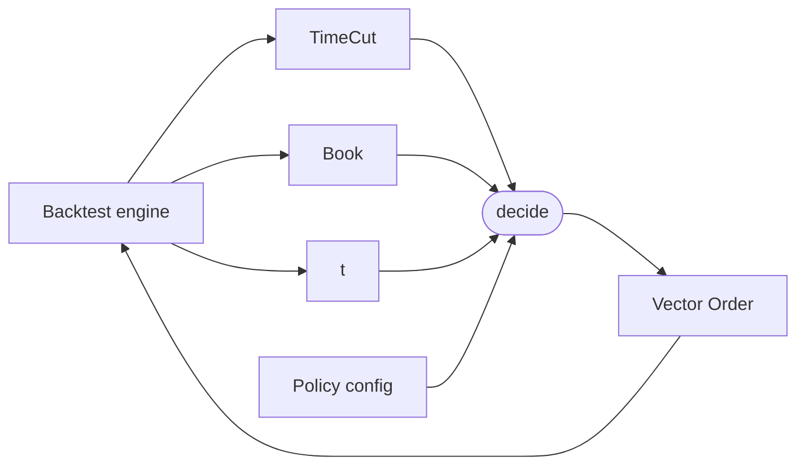

# `policies` module

Policy abstraction: a pure decision function the backtest engine
calls once per tick (after the [`Agent`](agents.md) hands one over).
A policy holds its immutable configuration (schedules, parameters,
fitted models) and implements [`decide`](@ref) to emit *orders* --
structure-level instructions with declared intent per leg -- given the
book. A close is a `Close` leg in an order naming the group it closes,
never a counter-trade, so the policy never mutates state and the
engine never guesses intent from direction.

Anything that changes between ticks -- refit cadence, parameter
learning, policy swaps over time -- belongs to the [`agents`](agents.md)
layer. A Policy itself is frozen for the duration of the tick on
which it was handed out.

## Data flow


```mermaid
flowchart LR
    Engine[Backtest engine] --> Cut[TimeCut]
    Engine --> Book[Book]
    Engine --> Clock[t]
    Cut --> D([decide])
    Book --> D
    Clock --> D
    Policy[Policy config] --> D
    D --> Orders[Vector Order]
    Orders --> Engine
```

The engine builds the time-cut data view, asks the agent for the
current policy, then hands `(t, cut, book)` to `decide` to produce the
orders for this tick.

## The abstraction

```julia
abstract type Policy end

decide(p::Policy, t::DateTime, data::TimeCut, book::Book) -> Vector{Order}

tick_times(p::Policy, data::MarketData, from, to) -> Union{Nothing, Vector{DateTime}}

declared_underlyings(p::Policy) -> Tuple of Underlying
```

One decision method, four arguments, one return value. Concrete
policies subtype `Policy` and implement `decide`. The empty return
`Order[]` is the "do nothing this tick" case and must be cheap.
Policies read data by kind and selector (`at(data, OptionQuote, u, t)`,
`only_or_missing(at(data, VolatilitySurface, u, t))`), never by
storage; "empty means absent" is the convention for every shape.

An `Order` is a label, its legs (each a `ContractKey`, a side, an
integer number of contracts and an `Open` / `Close` intent), the group
it opens into or closes, and an optional operation id linking the two
orders of a roll. An opening order leaves `group` as `nothing` and the
ledger mints one; **a close is a `Close` leg in an order naming the
group it closes** (`open_groups(book)`, `lots(book, g)`), never a
counter-trade. The engine books every order whole or not at all.

`book` is the engine's own fold of the ledger as known at this tick:
open lots per group and contract, plus cash, equal to
`book_as_known(L, known_to)` for the order records the tick produces. A
policy reads it and **must not mutate it**: it is handed by reference,
not copied per tick.

`declared_underlyings` reports the underlyings a policy fixes in its own
configuration, known without running it; the default is empty, meaning
"cannot be checked at load". `load_experiment` uses it to enforce that an
experiment ticks and trades on one underlying: the clock selector answers
*when* to step, fills resolve prices per leg, and asserting the two agree
is what keeps that safe. A policy that chooses its underlying per tick
declares nothing and is simply not checked.

`tick_times` is the optional sparse-schedule override: return the
candidate timestamps in `[from, to]` (sorted, unique) and the engine
calls `decide` only there; return `nothing` (the default) and the
engine walks the experiment's declared clock. Candidates need not
exist in the data.

### `NoOpPolicy`

```julia
struct NoOpPolicy <: Policy end
decide(::NoOpPolicy, _, _, _) = Order[]
```

The trivial policy. Useful as a smoke test for the engine and as
a base case in property tests.

## Key decisions

| Decision | Why |
|---|---|
| **Policy returns orders, not a portfolio** | A policy's natural output is "orders to fire," not "the portfolio I want after this tick." Orders keep the policy small (no need to redeclare unchanged positions), make the no-op case trivially `Order[]`, and let the ledger own the open-vs-close bookkeeping in one place. |
| **Intent is declared; a close names its group** | A counter-trade left the engine to guess intent from direction, and guessed wrong at a side flip. A `Close` leg naming a group is what a broker ticket says (position effect O/C), matches only within that group, and is refused when there is nothing to close, so a policy's mistake is a named failure at fill time rather than a silent new lot. |
| **The book, not the fill log, is what a policy sees** | The book is the view by replay a live loop hands a policy too: open lots per group and contract, plus cash. A policy that wants "what do I hold" reads it directly instead of netting a fill vector; it never sees expired legs as live once lifecycle is booked (slice 3). |
| **Stateless `decide`** | The policy struct holds only configuration. Any "state" the recurrence might want (rolling windows, last-action time, fitted predictions) is either derivable from `(t, data, book)` plus config, or it belongs to an [`Agent`](agents.md) that hands out a fresh Policy when state advances. Stateless `decide` is easier to test (no setup), easier to replay deterministically, and avoids confusion about whether to mutate or rebuild between ticks. |
| **No-lookahead is a type, not a convention** | `decide` accepts a [`TimeCut`](market_data.md), not the bare map. Every shape is empty strictly after `t`, and reads a derived provider makes on the policy's behalf go through the same cut. The legacy codebase enforced the same property via `HistoricalView` passed at runtime; the rebuild moves it into the function signature and into the data layer. |
| **`t` is an explicit argument** | Even though `data` is cut at `t`, schedule-driven policies that want to ask "is this my entry time?" shouldn't have to dig through `timestamps(data, ...)` for it. Making `t` explicit also gives the engine a trivially-cheap crosscheck against the cutoff. |
| **Gate inside `decide`, schedule with `tick_times`** | The engine's grid is the declared clock; a scheduled policy still gates inside `decide` (cheap, correct on any clock) and may narrow the engine's calls with `tick_times`. The window end stays a clock property, so the schedule can never move the settlement. |
| **Policy / Agent split (RL convention)** | "Policy = the decide function, Agent = the thing that carries the policy and the machinery that changes it" is the Sutton-&-Barto split. The rebuild adopts it verbatim rather than overloading one type with both responsibilities. A policy that depends on a fitted ridge model is still a frozen Policy; the *learning* that produced it lives in its [`Agent`](agents.md). |

## Responsibility boundaries

**Owns:** the `Policy` abstract type, the `decide` contract, the
`declared_underlyings` trait, the `NoOpPolicy` base case.

**Does NOT own:**

- The tick loop. That belongs to the [backtest engine](backtest.md);
  policies only react to one tick at a time.
- How a policy changes over time. That belongs to the
  [`agents`](agents.md) layer.
- Quote resolution and pricing. The engine prices each leg of a
  returned `Order` through the venue and books it in the ledger;
  policies never touch the chain directly to fill (they may inspect
  chains/surfaces to *decide*).
- Lot lifecycle. A close is a `Close` leg emitted by the policy and
  booked like any other order; there is no `close!` primitive, and
  expiries are booked by the engine's lifecycle step (slice 3).
- Reporting / PnL aggregation. Policies return orders, not P&L.
  Computing performance is downstream.

## Concrete policies

### `DailyShortStrangle`

The first real trading policy: once a day at `entry_time`, open a short
OTM put + short OTM call. Strikes are picked by target absolute delta
(via [`invert_delta`](surfaces.md)) and snapped to the slice's observed
strike grid so the engine's `resolve_quote` exact match succeeds.

```julia
struct DailyShortStrangle <: Policy
    underlying      :: Underlying
    entry_time      :: Time
    expiry_interval :: Period
    put_delta       :: Float64       # target |Δ| in (0, 1)
    call_delta      :: Float64       # target |Δ| in (0, 1)
    quantity        :: Int           # contracts per leg
end

function decide(p::DailyShortStrangle, t::DateTime, data::TimeCut, ::Book)
    Time(t) == p.entry_time || return Order[]                  # cheap gate
    surface = only_or_missing(at(data, VolatilitySurface, p.underlying, t))
    ismissing(surface) && return Order[]
    expiry  = _first_expiry_on_or_after(surface, t + p.expiry_interval)
    expiry === nothing && return Order[]
    chain   = at(data, OptionQuote, p.underlying, t); isempty(chain) && return Order[]

    K_put_raw  = invert_delta(surface, expiry, Put,  p.put_delta)
    K_call_raw = invert_delta(surface, expiry, Call, p.call_delta)
    (K_put_raw === nothing || K_call_raw === nothing) && return Order[]

    put_strikes  = _quoted_strikes(chain, expiry, p.underlying, Put)
    call_strikes = _quoted_strikes(chain, expiry, p.underlying, Call)
    K_put  = _snap_to_sorted(put_strikes,  K_put_raw)
    K_call = _snap_to_sorted(call_strikes, K_call_raw)
    (K_put === nothing || K_call === nothing) && return Order[]
    return Order[Order(:daily_short_strangle, [
        Leg(ContractKey(p.underlying, K_put,  expiry, Put),  Short, p.quantity, Open),
        Leg(ContractKey(p.underlying, K_call, expiry, Call), Short, p.quantity, Open),
    ])]
end
```

The two legs go out as one `Order`, so the venue fills them whole or
not at all and the ledger samples them as one structure. `quantity` is
an integer number of contracts (the config loader accepts `1` and
`1.0`, refuses `1.5`); the policy only opens, and lifecycle closes its
lots (slice 3).

Three properties worth noting:

- **Cheap gate first, sparse schedule second.** `Time(t) == entry_time`
  runs before any surface lookup, and `tick_times` emits one candidate
  per calendar day at `entry_time`, so a ten-year run is a few thousand
  `decide` calls whatever the clock.
- **Snap against the chain, not the slice.** `invert_delta` returns a
  *continuous* target K. The engine's `resolve_quote` requires an exact
  match on both strike *and* `option_type` against the quote chain at `t`.
  `slice.strikes` is the union of strikes that survived IV inversion --
  but per strike, only one side is retained by `build_surface._pick_otm`,
  so a slice strike near the spot may be Put-quoted only or Call-quoted
  only. Snapping per-leg to the chain's strikes-of-the-required-type is
  the authoritative fix.
- **One-wing failure = skip the entry.** If `invert_delta` returns
  `nothing` for either leg (target |Δ| outside the slice's observed
  bracket on that wing), the policy returns `Order[]` rather than
  trading the surviving leg alone. A one-legged "strangle" is a
  different structure and silently degrading would corrupt backtests.

## Future work

- **Explicit policy-local state.** Some policies will want to thread
  micro-state through (e.g. an intra-tick counter). Today that
  belongs to the surrounding Agent; if a pattern emerges where the
  state really is Policy-scoped, the signature can grow to
  `decide(p, t, data, book, state) -> (orders, state')` with a
  default `init_state(p, _) = nothing`.
- **Structures (iron condor, strangle, vertical) as first-class.**
  Today legs are constructed inline -- `DailyShortStrangle` builds two
  `Leg`s directly in `decide`. A scheduled iron condor would follow
  the same shape, swapping `invert_delta` for a 4-strike selector and
  returning one four-leg `Order`. Once two or three such policies
  exist, a `structures` module with helpers (credit, max-loss,
  wing-width, breakevens) that decompose into legs becomes worth
  introducing. Deferred until the duplication tells us what the helper
  surface should expose.
- **Live-trading bridge.** The same `decide` signature can drive a
  live loop: replace the backtest engine with one that resolves
  quotes from a broker feed instead of the quote chain, with the same
  Agent handing out the same Policy.

## Layout

```
src/policies/
    policy.jl                  # abstract Policy + decide + NoOpPolicy
    daily_short_strangle.jl    # DailyShortStrangle + helpers

test/policies/
    test_policy.jl             # both abstractions + DailyShortStrangle
```

All files are `include`d into the top-level `VolSurfaceAnalysis`
module; no submodule wrappers.
