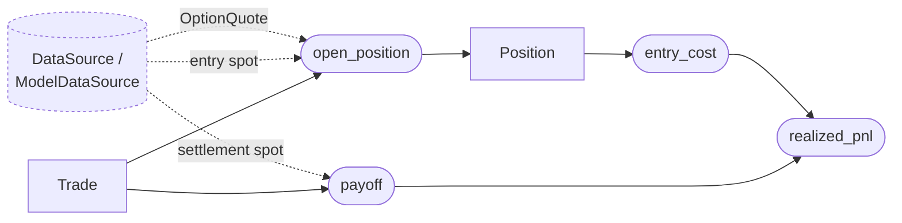

# `positions` module

Position-keeping primitives: an immutable `Trade` (what to do) and an
immutable `Position` (what was done, including the entry snapshot), plus
three pure functions to compute entry cost, expiry payoff, and realized
settlement PnL. Standalone -- consumed by a future backtest engine and,
later, a live-trading engine. The module has no opinion about where its
inputs came from.

## Data flow



A `Trade` is whatever the caller (strategy, ad-hoc script, trading
engine) decides. The data layer -- today a `DataSource`, soon a
`ModelDataSource` composed on top -- supplies the `OptionQuote` at fill
time and the spot observations used at both entry and expiry. The two
`spot` arrows are different observations, not the same scalar: one is
the underlying at fill, the other at settlement. Everything inside the
boxed nodes is owned by this module; the dashed upstream is not.

## Types

### `Trade`

Time-independent specification of an option contract to buy or sell. No
spot, no fill price, no timestamp. A `Trade` is constructible before any
market is consulted -- it is what a strategy decides, not what executed.

Fields: `underlying`, `strike`, `expiry`, `option_type`, `direction` (`+1`
long / `-1` short), `quantity` (contracts, `> 0`). The inner constructor
validates `direction`, `quantity`, and `strike`; the outer kwarg form
defaults to long-one-contract.

### `Position`

Immutable record of a filled trade. The entry-time snapshot
(`entry_price`, `entry_spot`, `entry_bid`, `entry_ask`, `entry_timestamp`)
is everything required to compute PnL against any future settlement spot.
No `close!`, no realized-PnL field, no lifecycle state.

`entry_price` is absolute USD per share, already signed by the fill side
(ask for a long, bid for a short). `entry_bid` / `entry_ask` are recorded
as-is from the source quote and may be `missing` for the side that was
not crossed. `entry_spot` is kept for diagnostics (sigma normalization,
log-returns); it is **not** load-bearing for PnL.

## Functions

```julia
payoff(trade, spot_at_expiry)             :: Float64
open_position(trade, qte, spot)           :: Position
entry_cost(position)                      :: Float64
realized_pnl(position, settlement_spot)   :: Float64
realized_pnl(positions, settlement_spot)  :: Float64
```

- **`payoff`** -- intrinsic value at expiry, signed by `direction`, scaled
  by `quantity`. Lives on `Trade` because it depends only on the contract
  and the spot at expiry; useful for scenario analysis and payoff diagrams
  without any entry information. Numeric inputs are accepted as `Real` and
  stored / computed as `Float64` at the boundary.
- **`open_position`** -- fills `trade` against an `OptionQuote`: longs
  cross the ask, shorts cross the bid. Validates that the quote describes
  the same contract (underlying / strike / expiry / option type), and
  throws when the fill side is `missing`. `entry_timestamp` comes from
  the quote.
- **`entry_cost`** -- signed cash at entry, USD:
  `entry_price * direction * quantity`. Positive when premium was paid,
  negative when received.
- **`realized_pnl`** -- realized PnL at expiry: `payoff(trade, spot) - entry_cost(pos)`.
  The name spells out *which* PnL: the cash-settled, at-expiry kind. Leaves
  the bare `pnl` name (and a future `unrealized_pnl` / `value`) free for the
  mark-to-market overload that takes a surface or quote rather than a
  settlement spot. The vector overload sums across legs (condor, strangle,
  ...) at one settlement spot.

## Responsibility boundaries

**Owns:** trade / position records, fill-side semantics, the four PnL
primitives.

**Does NOT own:**

- Quote resolution. The caller selects the right `OptionQuote` from a
  chain (or broker feed) and passes it in.
- Pricing math or surface / curve evaluation. `open_position` does not
  consult a `VolatilitySurface`; it takes already-resolved bid/ask.
- Schedules, expiry selection, entry / exit timing. Those are strategy /
  engine concerns.
- Mark-to-market valuation between entry and expiry. The current PnL
  primitive is cash settlement at expiry; intraday MtM lives elsewhere
  when needed.
- Mutation of any kind. Closing a position is modelled by computing its
  `realized_pnl` against the settlement spot, not by mutating fields.

## Key decisions

| Decision | Why |
|---|---|
| **Immutable `Trade` and `Position`** | Carry one canonical history (a `Vector{Position}`) through the system; PnL is recomputable from settlement spots, so storing it is a cache rather than state. Removes a class of "what is this object's current state" bugs and makes positions safe to persist. |
| **`payoff` on `Trade`, `realized_pnl` on `Position`** | Scenario analysis (breakevens, payoff diagrams) needs only the contract and a hypothetical spot; nothing about what was paid. Realized PnL needs the entry snapshot. Splitting cleanly separates "structure of the contract" from "what happened at fill." |
| **`realized_pnl`, not `pnl`** | The function only makes sense at settlement (it takes a settlement spot, returns `payoff - entry_cost`). Spelling out *which* PnL keeps the contract obvious at call sites and reserves the unqualified `pnl` (or `unrealized_pnl` / `value`) for the eventual mark-to-market overload that takes a surface or quote. The function is still a pure noun -- nothing is mutated. |
| **Absolute USD prices, not fraction-of-spot** | Equity-native. `entry_cost = entry_price * direction * quantity`, no multiplication by `entry_spot`. The legacy codebase's fractional convention was a Deribit holdover and is dropped. `entry_spot` is kept as a diagnostic, not a multiplier. |
| **`open_position` takes `OptionQuote`, not scalar `(bid, ask)`** | `OptionQuote` is the rebuild's canonical market record; `Trade` already depends on `Underlying` / `OptionType` from `data/quotes.jl`, so the additional coupling is cheap. The caller (backtester or trading engine) is responsible for picking the right quote for a contract. |
| **Throw on contract mismatch / missing fill side** | Mismatch is a programming bug (caller passed the wrong quote), not a missing-data condition -- loud failure is correct. A missing fill side means the market cannot fill that direction; surfacing it forces the strategy layer to decide what to do (skip, wait, retry) rather than silently swallow. |
| **`entry_bid` / `entry_ask` may be `Missing`** | Matches `OptionQuote`. The fill side must be present at open, but the opposite side is allowed to be unknown (e.g. Polygon OHLC paths). |
| **No mutation, no portfolio type** | A multi-leg structure is a `Vector{Position}`. The vector `realized_pnl` overload composes legs without introducing a `Portfolio` wrapper. Strategies / engines that want grouping can add their own type without touching this layer. |
| **`Underlying` field on `Trade`** | Multi-symbol-ready. Validating underlying match at `open_position` catches a common copy-paste bug; the field cost is trivial. |

## Future work

- **Position lifecycle for non-cash-settled contracts.** Cash settlement
  at expiry covers SPX-style index options and Deribit dailies. American
  exercise and early-close events will need explicit close-time pricing.
- **Mark-to-market.** A `value(position, surface, settlement_curve)`
  function over a surface would let intraday equity / risk computation
  reuse the position model. Pure function over the snapshot; no
  mutation required.
- **Multi-asset portfolio aggregation.** Today the vector `realized_pnl`
  overload assumes one settlement spot for all legs. A future overload
  taking a `Dict{Underlying, Float64}` (or a settlement source) covers
  cross-asset structures without changing `Position`.
