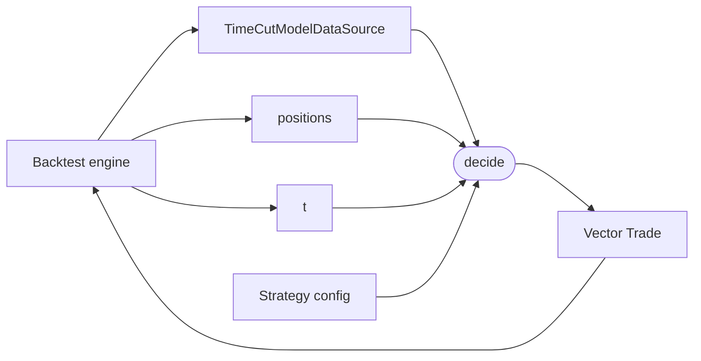

# `strategies` module

Strategy abstraction: a pure decision function the backtest engine
calls once per tick. A strategy holds its immutable configuration
(schedules, parameters, fitted models) and implements [`decide`](@ref)
to emit *trade deltas* -- new orders the engine should fill. Closes
are emitted as counter-trades (opposite direction, same contract),
so the strategy never mutates state and the engine never asks
"keep or close this position?".

## Data flow



The engine builds the time-cut data view, hands it (along with `t`
and the current ledger) to `decide`, and applies the returned trades
to produce the next ledger.

## The abstraction

```julia
abstract type Strategy end

decide(s::Strategy, t::DateTime, data::TimeCutModelDataSource,
       positions::AbstractVector{Position}) -> Vector{Trade}
```

One method, four arguments, one return value. Concrete strategies
subtype `Strategy` and implement `decide`. The empty return
`Trade[]` is the "do nothing this tick" case and must be cheap --
sparse strategies (e.g. "trade once a day at 13:00") rely on it
firing tens of thousands of times.

### `NoOpStrategy`

```julia
struct NoOpStrategy <: Strategy end
decide(::NoOpStrategy, _, _, _) = Trade[]
```

The trivial strategy. Useful as a smoke test for the engine and as
a base case in property tests.

## Key decisions

| Decision | Why |
|---|---|
| **Strategy returns trade deltas, not a portfolio** | A strategy's natural output is "orders to fire," not "the portfolio I want after this tick." Deltas keep the strategy small (no need to redeclare unchanged positions), make the no-op case trivially `Trade[]`, and let the engine own the open-vs-close translation in one place. |
| **Closes are counter-trades** | Rather than a separate `Close` action type or a mutable `Position`, a close is a regular `Trade` with opposite direction on the same contract. The ledger ends up holding both sides; net-open is a view (`sum(direction * quantity)` per contract). Keeps `Position` immutable and the engine path uniform: every order goes through `open_position`. A dedicated `closed::Vector{...}` register is a later convenience, not a primitive. |
| **Stateless `decide`** | The strategy struct holds only configuration. Any "state" the recurrence might want (rolling windows, last-action time, fitted predictions) is either derivable from `(t, data, positions)` plus config, or it belongs to a future explicit-state variant. Stateless is easier to test (no setup), easier to replay deterministically, and avoids confusion about whether to mutate or rebuild between ticks. |
| **No-lookahead is a type, not a convention** | `decide` accepts a [`TimeCutModelDataSource`](backtest.md), not a raw `ModelDataSource`. Through the supported accessor interface, queries strictly after `t` return `nothing` / `missing`. Master enforced the same property via `HistoricalView` passed at runtime; the rebuild moves it into the function signature so accidental bypass is much harder. |
| **`t` is an explicit argument** | Even though `data` is cut at `t`, schedule-driven strategies that want to ask "is this my entry time?" shouldn't have to dig through `available_timestamps(data, ...)` for it. Making `t` explicit also gives the engine a trivially-cheap crosscheck against the cutoff. |
| **No engine-side schedule protocol** | Master had `entry_schedule(strategy)::Vector{DateTime}` driving the engine loop. The rebuild drops that: the engine walks every available timestamp and the strategy gates inside `decide`. A scheduled strategy's `decide` becomes a hash-lookup; the cost on minute-data over a year is ~7ms of waste, dominated by data IO. Removing the protocol means one less concept and a uniform driver shape. |

## Responsibility boundaries

**Owns:** the `Strategy` abstract type, the `decide` contract, the
`NoOpStrategy` base case.

**Does NOT own:**

- The tick loop. That belongs to the [backtest engine](backtest.md);
  strategies only react to one tick at a time.
- Quote resolution. The engine maps each returned `Trade` to an
  `OptionQuote` and a `Position`; strategies never touch the chain
  directly to fill (they may inspect chains/surfaces to *decide*).
- Position lifecycle. A close is a counter-trade emitted by the
  strategy and filled like any other order; there is no `close!`
  primitive.
- Reporting / PnL aggregation. Strategies return orders, not P&L.
  Computing strategy performance is downstream.

## Adding a concrete strategy

A scheduled iron condor in this design looks like:

```julia
struct DailyEntryIronCondor{F} <: Strategy
    entry_time::Time
    expiry_interval::Period
    strike_selector::F
    quantity::Float64
end

function decide(s::DailyEntryIronCondor, t::DateTime,
                data::TimeCutModelDataSource, ::AbstractVector{Position})::Vector{Trade}
    Time(t) == s.entry_time || return Trade[]   # cheap gate first
    surface = get_surface(data, t)
    surface === nothing && return Trade[]
    expiry = select_expiry(s.expiry_interval, surface)
    expiry === nothing && return Trade[]
    strikes = s.strike_selector(surface, expiry, data)
    strikes === nothing && return Trade[]
    sp_K, sc_K, lp_K, lc_K = strikes
    und = surface.underlying
    q   = s.quantity
    return Trade[
        Trade(und, sp_K, expiry, Put;  direction=-1, quantity=q),
        Trade(und, sc_K, expiry, Call; direction=-1, quantity=q),
        Trade(und, lp_K, expiry, Put;  direction=+1, quantity=q),
        Trade(und, lc_K, expiry, Call; direction=+1, quantity=q),
    ]
end
```

Gate on the cheap predicate (`Time(t)`) before any data lookup; the
fast path on a no-op tick should not touch surfaces or chains.

## Future work

- **Explicit state.** Some strategies will want to thread state
  through (rolling estimators, adaptive thresholds, fitted models
  warmed on past ticks). When that need is concrete, the signature
  grows to `decide(s, t, data, positions, state) -> (orders, state')`;
  current stateless strategies keep working under a default
  `init_state(s, _) = nothing`.
- **Strategy-controlled tick cadence.** If a strategy is sparse on a
  high-frequency tick stream and per-tick gating starts to matter,
  add an opt-in `tick_times(strategy, source)` override returning
  the explicit timestamps to call `decide` at. Default is "every
  available timestamp."
- **Structures (iron condor, strangle, vertical) as first-class.**
  Today legs are constructed inline. A future `structures` module
  with `IronCondor{Trade}` -> `IronCondor{Position}` would attach
  helpers (credit, max-loss, wing-width, breakevens) and let
  strategies return structures whose `legs` decompose into trades.
- **Live-trading bridge.** The same `decide` signature can drive a
  live loop: replace the backtest engine with one that resolves
  quotes from a broker feed instead of `get_chain`, and `next_t` /
  state additions become relevant.

## Layout

```
src/strategies/
    strategy.jl     # abstract Strategy + decide + NoOpStrategy

test/strategies/
    test_strategy.jl
```

All files are `include`d into the top-level `VolSurfaceAnalysis`
module; no submodule wrappers.
